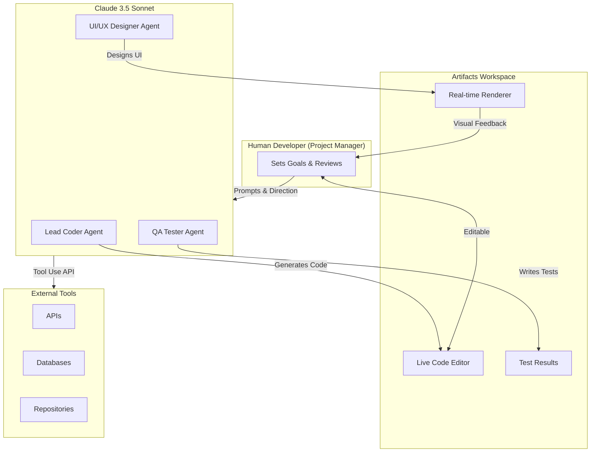
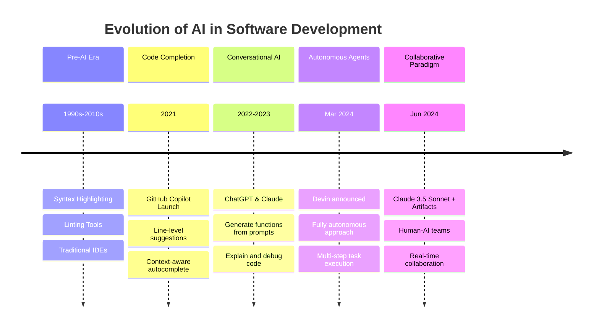

# Claude Code Agent Teams: The Human-AI Collaborative Paradigm for Software Development

**TL;DR:** Anthropic's Claude 3.5 Sonnet and Artifacts feature enable a new paradigm where developers orchestrate AI agent teams for collaborative software engineering, prioritizing human control over full autonomy. This approach transforms developers from pure coders into project managers who direct specialized AI personas for coding, testing, and design tasks within a real-time interactive workspace.

## The Evolution from Code Completion to AI Collaboration

Software development has undergone a quiet revolution over the past five years. What started as intelligent autocomplete has evolved into something far more ambitious: AI systems capable of reasoning about entire codebases and executing complex development tasks.

The journey began with tools like GitHub Copilot in 2021, which introduced developers to line-level code suggestions based on context. Trained on billions of lines of public code, Copilot could anticipate what developers wanted to type next with surprising accuracy. But it remained fundamentally a reactive tool, offering suggestions that developers would accept, reject, or modify.

Conversational AI assistants like ChatGPT and Claude emerged in 2022-2023, introducing a new interaction pattern. Developers could now describe functionality in natural language and receive complete functions, debug explanations, and architectural guidance. Yet the workflow remained fragmented: prompt the AI, receive code, copy it to an IDE, test, identify issues, return to the AI with modifications, and repeat.

Then came Devin in March 2024. [Cognition AI's announcement](https://www.cognition.ai/blog/introducing-devin) of the "first AI software engineer" sparked intense debate across the industry. Devin promised full autonomy: give it a task, and it would research, plan, write code, debug, and deploy without human intervention. The reaction was polarized. Some saw the future of software development; others saw a black box that threatened both developer jobs and software quality.

The fundamental question remained unanswered: Is full AI autonomy the right path forward, or is there a better model that preserves human expertise while amplifying productivity?

## Anthropic Introduces a Different Vision with Claude 3.5 Sonnet

[Anthropic's launch of Claude 3.5 Sonnet in June 2024](https://www.anthropic.com/news/claude-3-5-sonnet) presented an alternative answer. Rather than pursuing full autonomy, Anthropic built a system designed for human-AI collaboration, where developers maintain control while AI handles increasingly sophisticated development tasks.

The centerpiece of this approach is the Artifacts feature. Unlike previous AI coding assistants that simply output text, Artifacts creates a live, editable workspace alongside the conversation. When Claude generates code, it appears in a dedicated panel where developers can see it render in real-time, make modifications directly, and request further iterations without copying anything to external tools.

The technical improvements are substantial. [According to benchmark data](https://paperswithcode.com/sota/code-generation-on-humaneval), Claude 3.5 Sonnet scores 92.0% on HumanEval, a standard benchmark for code generation, up from 84.9% for Claude 3 Opus. It accomplishes this while operating at twice the speed and significantly lower cost than its predecessor. The model's 200,000-token context window, equivalent to approximately 150,000 words, means it can analyze and reason about entire project codebases rather than isolated code snippets.

But the real innovation is conceptual rather than purely technical. Claude Code Agent Teams represent a paradigm shift from passive code completion to active human-AI collaboration, where developers act as project managers orchestrating specialized AI personas for coding, testing, and design tasks.

## How Claude Code Agent Teams Work

The system operates through four synergistic components that together create an integrated development environment unlike anything previously available.

### Claude 3.5 Sonnet: The Reasoning Engine

At the foundation lies Claude 3.5 Sonnet itself. [The model family technical report](https://www.anthropic.com/news/claude-3-family) details how Claude combines advanced reasoning capabilities with vision understanding and extensive training on code repositories. This enables the model to understand not just code syntax but the intent behind architectural decisions, the relationships between components, and the implications of proposed changes.

Developers can invoke different "personas" by adjusting their prompts. Request that Claude act as a senior backend architect, and the responses emphasize scalability, database design, and API contracts. Frame it as a QA engineer, and Claude shifts to edge case analysis, test coverage, and failure mode identification.

### Artifacts: The Interactive Workspace

Artifacts transforms the development workflow by eliminating the copy-paste cycle that characterized earlier AI coding tools. When Claude generates a React component, it renders immediately in the Artifacts panel. When it produces an SVG diagram, developers see the visual output. When it writes Python code, they can examine and edit it in place.

This creates a tight feedback loop. Developers can say "make that button larger" or "add error handling for network failures" and see the changes applied instantly. The conversation becomes a real-time collaborative editing session rather than a series of isolated requests and responses.

### The 200K Token Context Window

Context is everything in software development. A function that seems simple in isolation may have complex dependencies, unexpected edge cases, or historical reasons for its current implementation. Previous AI coding tools, limited to a few thousand tokens, could only see fragments of a codebase at a time.

Claude's 200,000-token context window changes this calculus fundamentally. Developers can feed entire project directories to the model, enabling it to understand how components interact, identify inconsistencies across files, and make refactoring suggestions that account for the full system architecture. For a medium-sized project of 50,000 lines of code, Claude can hold the entire codebase in context while maintaining a productive conversation.

### Tool Use APIs: Extending Agent Capabilities

The final component is Claude's ability to use external tools through its API. Developers can create specialized agents with access to testing frameworks, databases, deployment pipelines, and external services. An agent might run unit tests after generating code, query a database to understand schema constraints, or check API documentation before implementing an integration.

This extensibility allows teams to build customized development workflows. A fintech company might create agents with access to compliance checking tools. A game studio could integrate agents with asset management systems. The possibilities expand with each API connection.

## The Developer as Project Manager

The most profound shift in Claude Code Agent Teams is not technological but organizational. Developers using this paradigm report that their role transforms from primarily writing code to primarily directing and reviewing AI-generated work.

Consider a typical workflow. A developer needs to implement a user authentication system. In the traditional model, they would design the architecture, write the database schema, implement the API endpoints, build the frontend forms, write tests, and debug issues, potentially days of focused coding work.

With Claude Code Agent Teams, the workflow changes. The developer describes the requirements to Claude, perhaps including existing codebase context. Claude generates an initial implementation in Artifacts. The developer reviews, identifies issues with the session management approach, and provides feedback. Claude revises. The developer asks Claude to switch personas and critique its own code from a security perspective. Claude identifies potential vulnerabilities. The developer requests tests for edge cases. Claude generates a comprehensive test suite.

Throughout this process, the developer makes architectural decisions, catches conceptual errors the AI misses, and ensures the final result meets project requirements. But the mechanical work of translating decisions into code shifts substantially to the AI.

This is the "centaur" model that chess players discovered decades ago: human-AI hybrids consistently outperform either humans or AI working alone. The human provides judgment, creativity, and domain knowledge; the AI provides speed, consistency, and tireless attention to detail.

## Why This Matters for the Software Industry

The implications of Claude Code Agent Teams extend across multiple stakeholder groups, each facing distinct opportunities and challenges.

### For Individual Developers

The immediate impact is a productivity multiplier. Tasks that previously required hours of focused coding can be accomplished in minutes of directed conversation. But this comes with a fundamental shift in required skills.

The developer of the future needs expertise in prompt engineering, the ability to communicate requirements clearly to AI systems and recognize when the AI has misunderstood. They need stronger system design skills, since AI handles implementation details but someone must still architect the overall solution. And they need sharper critical evaluation abilities, the capacity to recognize subtle bugs, security vulnerabilities, or architectural flaws in AI-generated code.

Junior developers face a particular challenge. Traditional career progression involves writing large amounts of code, building intuition through practice, and learning from mistakes. If AI handles most code generation, how do newcomers develop these instincts? The industry has yet to answer this question definitively.

### For Businesses

The business case is straightforward: shorter development cycles, reduced personnel costs for certain types of work, and the ability to prototype rapidly before committing resources. A startup that previously needed five engineers might accomplish similar output with two engineers directing AI agents effectively.

But there are hidden costs. AI-generated code requires review by experienced developers who can catch issues the AI misses. Security review becomes more critical when code is generated rather than carefully crafted. And organizations must invest in training developers to work effectively with AI tools.

The net effect varies by context. For greenfield projects with clear requirements, the productivity gains can be dramatic. For complex legacy systems with decades of accumulated technical debt and undocumented behavior, AI agents may struggle to provide useful assistance.

### For the Industry

Claude Code Agent Teams present a compelling alternative to full AI autonomy that may shape the industry's direction. Rather than debating whether AI will "replace" developers, this approach reframes the question: How can AI amplify human developers most effectively?

The implications extend to development tools themselves. Traditional IDEs, designed around human developers typing code, may evolve into cloud-native AI-integrated environments where the primary interaction is conversational. Version control systems may need to adapt to workflows where large portions of code are AI-generated. Code review practices may need to account for the specific failure modes of AI systems.

Perhaps most significantly, this paradigm could democratize software development. Tasks that currently require years of programming experience might become accessible to domain experts who can effectively describe what they need. A biomedical researcher could direct AI agents to build analysis tools. A small business owner could create custom inventory systems. The barrier shifts from "can you code?" to "can you specify clearly what you need?"

## Risks and Limitations

No technology assessment is complete without honest engagement with downsides. Claude Code Agent Teams face several categories of risk that practitioners must navigate.

### Technical Limitations

Code hallucinations remain a persistent challenge. AI models can generate code that looks correct but contains subtle bugs, uses APIs that do not exist, or makes assumptions that violate project constraints. The 92% HumanEval score means 8% of generated code has issues, and real-world projects are more complex than benchmark problems.

Dependency management presents another challenge. AI agents may suggest outdated libraries, fail to account for version conflicts, or recommend packages with security vulnerabilities. Without careful human oversight, these issues can propagate into production systems.

Long-term memory limitations also constrain the approach. While the 200K token context window is large, it is not infinite. For projects that exceed this limit, or for development work spanning multiple sessions, the AI loses context that a human developer would naturally retain.

### Security Concerns

Executing AI-generated code introduces attack surface. Malicious prompts could potentially manipulate the AI into generating code with backdoors or vulnerabilities. Even without malicious intent, AI-generated code may contain security flaws like SQL injection vulnerabilities, improper authentication handling, or insecure data storage.

Data privacy presents additional concerns. Feeding proprietary source code to third-party AI APIs means that code exists on external servers, subject to the provider's data handling practices. For organizations with strict confidentiality requirements, this may be unacceptable without self-hosted solutions.

Supply chain vulnerabilities round out the security picture. AI agents that automatically select and include dependencies could be tricked into using malicious packages, or might recommend libraries with known vulnerabilities. This requires vigilant oversight of AI recommendations.

### Human Factors

Over-reliance on AI risks skill atrophy among developers. If junior developers never write substantial code themselves, they may not develop the intuition needed to catch AI errors. Organizations must balance AI-assisted productivity with deliberate skill development.

Cognitive overhead is also significant. Managing multiple AI personas, tracking context across conversations, and reviewing substantial volumes of generated code requires sustained attention. Some developers report exhaustion from the constant evaluation required.

Finally, the approach remains unproven for the hardest cases. Enterprise systems with millions of lines of legacy code, sparse documentation, and decades of accumulated business logic present challenges that may exceed current AI capabilities. These systems constitute a substantial portion of the world's software, and they cannot simply be rewritten.

## Frequently Asked Questions

### What is the difference between Claude Code Agent Teams and GitHub Copilot?

GitHub Copilot operates as an autocomplete tool, suggesting lines or blocks of code based on local context. Claude Code Agent Teams is a collaborative paradigm where the developer acts as a project manager orchestrating AI for entire development components. The Artifacts feature provides a real-time interactive workspace where code renders and executes immediately, creating a tight feedback loop that goes far beyond code completion. Copilot assists with writing code; Claude Code Agent Teams can handle entire development workflows under human direction.

### How does this approach compare to fully autonomous AI engineers like Devin?

Unlike Devin's fully autonomous black-box approach, Claude Code Agent Teams emphasizes human-in-the-loop collaboration. The developer maintains control and provides critical oversight at every step, making it more practical and safer for production use. Experts view this as the "centaur" model where human-AI hybrids outperform either alone. Full autonomy may eventually prove viable, but the collaborative approach offers immediate practical benefits with fewer risks.

### What are the main security concerns with AI code agents?

The core security concerns include: executing AI-generated code that could contain vulnerabilities like SQL injection or authentication bypasses; data privacy risks when feeding proprietary source code to third-party APIs; and supply chain vulnerabilities where agents might be tricked into using malicious packages or outdated libraries with known CVEs. Organizations must implement rigorous review processes for all AI-generated code, treating it with the same scrutiny applied to code from untrusted external sources.

### Can Claude Code Agent Teams work with large existing codebases?

Claude's 200K token context window, approximately 150,000 words or 50,000 lines of code, allows analysis of substantial codebases. The model can reason about entire projects for consistency, refactoring, and cross-cutting concerns. However, effectiveness on large, complex, and poorly documented legacy systems remains unproven. The approach works best for greenfield projects and small-to-medium codebases; navigating decades of technical debt and undocumented business logic likely exceeds current model capabilities.

### What skills will developers need in the AI agent team paradigm?

The developer role evolves from pure coder to AI orchestrator and systems architect. Critical skills include: prompt engineering to effectively direct AI agents and recognize misunderstandings; system design to maintain high-level architecture control; critical evaluation of AI-generated code to catch subtle bugs and security issues; and the ability to decompose complex projects into manageable AI-assistable tasks. Traditional coding skills remain essential for debugging, innovation, and handling cases where AI struggles.

### How do organizations ensure code quality when using AI agents?

Organizations should treat AI-generated code with the same rigor applied to external contributions. This means mandatory code review by experienced developers, automated testing with high coverage requirements, security scanning for common vulnerabilities, and staged deployment to catch issues before production. Some teams adopt a policy where AI generates initial implementations but humans must understand and take ownership of all code before it merges to main branches.

## The Path Forward

Claude Code Agent Teams represent neither the end of human programming nor a failed experiment. They mark a waypoint in the ongoing evolution of software development, one that offers substantial productivity gains while preserving the human judgment that remains essential for high-quality software.

The question for developers and organizations is not whether to adopt AI-assisted development, that ship has sailed, but how to adopt it effectively. This requires honest assessment of capabilities and limitations, investment in new skills and processes, and willingness to evolve practices as the technology matures.

For now, the most successful approach appears to be thoughtful integration: using AI agents for tasks where they excel, maintaining human oversight for judgment-intensive decisions, and building organizational practices that capture the benefits while managing the risks.

The centaur has arrived. The question is how to ride it effectively.

## References

- [Claude 3.5 Sonnet and Artifacts Launch Announcement](https://www.anthropic.com/news/claude-3-5-sonnet) — Anthropic, June 20, 2024
- [Claude 3 Model Family Technical Report](https://www.anthropic.com/news/claude-3-family) — Anthropic, March 4, 2024
- [HumanEval Benchmark Results for Code Generation](https://paperswithcode.com/sota/code-generation-on-humaneval) — Papers With Code, June 20, 2024
- [Devin: The First AI Software Engineer](https://www.cognition.ai/blog/introducing-devin) — Cognition AI, March 12, 2024
