# Claude Code Agent Teams: Multi-Agent Development with Opus 4.6

**TL;DR:** Anthropic releases Claude Opus 4.6 with Agent Teams, enabling 16 parallel AI agents to autonomously build a 100,000-line C compiler for $20,000—signaling the shift from AI as "copilot" to AI as "co-worker."

## From Copilot to Coordinated Squad

Twenty-seven minutes. That's how long separated Anthropic's Opus 4.6 announcement from OpenAI's GPT-5.3-Codex launch on February 5, 2026. The timing wasn't coincidental—it marked the beginning of a new phase in the agentic AI arms race.

But while OpenAI focused on execution speed and OS integration (Codex is 25% faster on execution-focused tasks), Anthropic took a different path: deep reasoning and multi-day complex engineering. The vehicle for this vision? **Agent Teams**.

As AI coding assistants evolved from autocomplete to autonomous agents, a fundamental limitation emerged: single-session context degradation. Long conversations caused "context rot" where models lost track of earlier decisions. Meanwhile, complex engineering tasks require parallel exploration—something a linear assistant couldn't provide.

Agent Teams solves both problems by enabling multiple Claude instances to work as a coordinated squad, each with its own context window.

## What Makes Agent Teams Different

On February 5, 2026, alongside Opus 4.6's release, Anthropic transformed Claude Code from a linear coding assistant into an orchestration platform. The new architecture enables a "lead" agent to spawn and coordinate multiple "teammate" agents—and the distinction from traditional subagents is crucial.

| Feature | Subagents | Agent Teams |
|---------|-----------|-------------|
| Context | Shared with parent | Independent per agent |
| Communication | Report to caller only | Peer-to-peer messaging |
| Lifecycle | Within main session | Independent processes |
| Best for | Quick tool usage | Parallel exploration |

Opus 4.6 itself brings significant upgrades: a **1 million token context window** (in beta) and **128,000 token maximum output**—double the previous limit. These expanded limits were specifically engineered to support longer thinking budgets and comprehensive agentic workflows.

The release rolled out simultaneously across the Anthropic API, Amazon Bedrock, and Google Vertex AI.

## The Four Pillars of Agent Teams Architecture

Agent Teams mimics a human engineering team structure through four core components:

```mermaid
graph TD
    User["👤 Developer"] --> Lead["🎯 Team Lead<br/>(Primary Session)"]
    Lead --> TaskList["📋 Shared Task List<br/>~/.claude/tasks/{team}/"]
    Lead -->|Spawns| T1["🤖 Teammate 1"]
    Lead -->|Spawns| T2["🤖 Teammate 2"]
    Lead -->|Spawns| T3["🤖 Teammate 3"]
    
    subgraph "Independent Contexts"
        T1
        T2
        T3
    end
    
    T1 <-.->|P2P Message| T2
    T2 <-.->|Broadcast| T3
    T1 --> TaskList
    T2 --> TaskList
    T3 --> TaskList
    TaskList --> Git["🔀 Git File Locking"]
    
    Config["⚙️ ~/.claude/teams/{name}/config.json"]
```



**1. The Team Lead**
The primary Claude Code session you interact with. The Lead handles high-level planning, task decomposition, spawning teammates, and synthesizing results. Use `Shift+Tab` to cycle into "delegate mode" where the Lead focuses purely on orchestration rather than implementation.

**2. Teammates**
Independent Claude Code instances, each with its own process and context window. They don't inherit the Lead's conversation history but load project context (`CLAUDE.md`, MCP servers). Configuration lives at `~/.claude/teams/{team-name}/config.json`.

**3. Shared Task List**
File-based synchronization at `~/.claude/tasks/{team-name}/`. Tracks work items through states (pending, in progress, completed) and manages dependencies. File locking prevents race conditions when multiple agents claim tasks.

**4. The Mailbox**
Asynchronous inter-agent messaging. Teammates use `message` for direct communication or `broadcast` to reach the whole team—without routing through the Lead.

### Display Modes: Watching Your Squad Work

Managing multiple agents in a terminal requires visibility. Claude Code offers two display modes via `--teammate-mode`:

**In-Process (Default):** All agents share one terminal window. Toggle views with `Shift+Up/Down`. Works everywhere but can feel cramped.

**Split-Pane (tmux/iTerm2):** Each teammate gets its own pane. Monitor all agents simultaneously—like a security command center. Start with:

```bash
claude --teammate-mode tmux
```

### Control Commands

Beyond natural language, Agent Teams offers granular control:

- **Delegate mode:** `Shift+Tab` — Lead focuses on orchestration only
- **Plan approval:** Tell the Lead "Require plan approval" — teammates enter read-only until verified
- **Direct intervention:** `Escape` to interrupt any teammate; message them directly bypassing Lead

## The Carlini Experiment: 16 Agents, One Compiler

The defining stress test came from Anthropic researcher **Nicholas Carlini**. The challenge: have 16 Claude agents build a C compiler from scratch, with zero human intervention.

**The Setup:**
- 16 Claude Opus 4.6 agents running in parallel
- Each in its own Docker container
- "Clean room" environment—no internet during build
- Git-based file locking for coordination
- Agents claim tasks by writing lock files, push completed code upstream

**The Results (over two weeks):**
- ~2,000 Claude Code sessions
- **$20,000** in API costs
- **100,000 lines** of Rust code
- Successfully compiles **Linux 6.9** for x86, ARM, and RISC-V
- **99% pass rate** on GCC torture tests
- Compiles and runs **Doom**

No human orchestration. The agents autonomously handled task decomposition, conflict resolution, and integration.

## Why This Changes Everything

The compiler experiment isn't a party trick—it's a proof point for a new development paradigm.

**Economics of scale:** $20,000 sounds expensive until you calculate the salary cost of senior engineers building a compiler over two weeks. For complex, high-value projects, Agent Teams offers compelling ROI.

**Parallel hypothesis testing:** When debugging an unknown issue, the Lead spawns agents to investigate competing theories simultaneously. "Agent A, check database latency. Agent B, investigate frontend state management." Converge on root cause faster.

**Multi-lens code review:** Different agents review the same PR with different focuses—security, performance, architectural consistency—all at once. No waiting for sequential review passes.

**Read-heavy exploration:** Tasks requiring massive documentation ingestion that would overflow a single context. Agents divide reading, report summaries to the Lead.

**Cross-layer refactoring:** Frontend, backend, and test suites updated simultaneously by different agents, ensuring feature parity during migrations.

## The "Vibe Coding" Movement

Agent Teams has catalyzed what developers call **"Vibe Coding"**—a style where humans direct high-level intent while AI handles implementation. Developer Steve Yegge coined **"Gas Town"** to describe large-scale, chaotic-yet-productive agent orchestrations.

Early adopters report:
- Perfect scores on coding benchmarks
- 3D simulations generated in "one shot"
- Significant productivity gains for debugging via competing hypotheses

The cultural shift: from pair programming with AI to managing an autonomous engineering squad.

## Risks, Costs, and Reality Checks

Agent Teams is a **research preview**. The rough edges are real.

**Cost:** The $20,000 compiler makes clear this isn't for everyday coding. Agent Teams is economical for high-value, complex projects—not routine tasks. Early users describe costs as "expensive as hell" for unoptimized workflows.

**File conflicts:** Multiple agents editing the same files creates merge challenges. The coordination layer handles task claiming but not granular conflict resolution within files. **Precise task decomposition is critical**—vague instructions lead to agents stepping on each other.

**No session resumption:** Long-running operations are fragile. If a session drops, recovery is manual.

**Configuration complexity:** It's experimental. Enable it with:

```bash
export CLAUDE_CODE_EXPERIMENTAL_AGENT_TEAMS=1
```

Or in `~/.claude/settings.json`:

```json
{
  "env": {
    "CLAUDE_CODE_EXPERIMENTAL_AGENT_TEAMS": "1"
  }
}
```

Then ensure `tmux` is installed for split-pane visualization.

## Claude Agent Teams vs. OpenAI Codex

The 27-minute launch gap invites comparison:

| Dimension | Claude Opus 4.6 + Agent Teams | OpenAI GPT-5.3-Codex |
|-----------|------------------------------|---------------------|
| **Philosophy** | Deep reasoning, orchestration | Execution speed, tooling |
| **Architecture** | Swarm-based, peer-to-peer | Desktop app command center |
| **Context** | 1M tokens (beta) | Optimized for faster turns |
| **Strength** | Complex, multi-day projects | Fast execution, OS integration |
| **Benchmark edge** | Reasoning, code-fix verification | Execution speed (+25%), environment interaction |

Analysts summarize: Codex is a highly efficient "workhorse." Opus 4.6 is a "strategist" or engineering manager handling broader scope.

## Frequently Asked Questions

### How are Agent Teams different from subagents?

Subagents share the main session's context and report only to the caller—they're sequential workers. Agent Teams spawn independent processes with isolated context windows and peer-to-peer messaging. Use subagents for quick tool calls; use Agent Teams for parallel exploration of massive codebases.

### How much does running Agent Teams cost?

Opus 4.6 pricing: $5/M input tokens, $25/M output (same as 4.5). The C compiler experiment cost ~$20,000 over two weeks with 16 agents. For typical 2-4 agent workflows on smaller tasks, expect $50-500 depending on complexity and duration.

### Can I try Agent Teams today?

Yes—it's a research preview. Set `CLAUDE_CODE_EXPERIMENTAL_AGENT_TEAMS=1` in your environment or `~/.claude/settings.json`, install `tmux`, and expect experimental behavior. The feature works but isn't production-hardened.

### What's the ideal use case for Agent Teams?

High-value projects where parallel exploration beats sequential work: large codebase refactoring, multi-system migrations, complex debugging, or audits requiring multiple specialized "lenses." Not ideal for quick fixes or cost-sensitive everyday coding.

### How does the shared task list prevent conflicts?

File locking at `~/.claude/tasks/` prevents multiple agents from claiming the same task. But file-level edit conflicts within code require careful task decomposition—the system handles task claiming, not merge resolution.

## References

- [Anthropic releases Opus 4.6 with new 'agent teams'](https://techcrunch.com/2026/02/05/anthropic-releases-opus-4-6-with-new-agent-teams/) — TechCrunch, February 5, 2026
- [Sixteen Claude AI agents working together created a new C compiler](https://arstechnica.com/ai/2026/02/sixteen-claude-ai-agents-working-together-created-a-new-c-compiler/) — Ars Technica, February 6, 2026
- [Building a C compiler with a team of parallel Claudes](https://www.anthropic.com/engineering/building-c-compiler) — Anthropic Engineering Blog, February 5, 2026
- [Agent Teams Documentation](https://code.claude.com/docs/en/agent-teams) — Claude Code Docs, February 5, 2026
- [Breaking: Opus 4.6 and Agent Teams](https://hyperdev.matsuoka.com/p/article-opus-46-and-agent-teams) — HyperDev, February 5, 2026
