# Claude Code Agent Teams: Multi-Agent AI Development

**TL;DR:** Anthropic's Claude Opus 4.6 introduces Agent Teams — a Claude Code feature where multiple AI agents coordinate on the same project with independent contexts, shared task lists, and peer-to-peer communication. In a stress test, 16 agents autonomously wrote a 100,000-line C compiler for $20,000 in API costs.

## Why Single-Agent Coding Hits a Wall

Every developer who has used an AI coding assistant knows the pattern: conversations start sharp, then degrade. The model forgets earlier architectural decisions, contradicts its own naming conventions, and loses track of which files it already modified. This is context rot — the inevitable decay of coherence in long LLM sessions.

The problem compounds with complex engineering tasks. Refactoring a large codebase requires simultaneous investigation of frontend state, backend APIs, database schemas, and test coverage. A single agent processing these sequentially wastes time and context window capacity on task-switching overhead.

The industry tried two approaches: autonomous agents that work alone (Devin, Codex CLI) and copilots that assist humans line-by-line (GitHub Copilot). Neither solved the coordination problem. What was missing was something closer to how human engineering teams actually work — parallel specialists with a shared understanding of the project.

## Opus 4.6 and the Agent Teams Launch

On February 5, 2026, Anthropic released [Claude Opus 4.6](https://www.anthropic.com/news/claude-opus-4-6) with several major upgrades. Twenty-seven minutes later, OpenAI shipped GPT-5.3 Codex. The timing was not coincidental — multi-agent AI development had become the new frontier.

**Claude Opus 4.6 Key Stats:**
- SWE-bench Verified: 80.8% (leading all frontier models)
- OSWorld: 72.7%
- Humanity's Last Exam: 53.1% (highest among all models)
- ARC AGI 2: 68.8% (nearly 2× Opus 4.5's 37.6%)
- Context window: 1M tokens (beta), up from 200K
- Max output: 128K tokens (up from 64K)
- Pricing: $5/M input, $25/M output
- Adaptive thinking: low / medium / high / max effort levels

The headline feature for developers was Agent Teams — not an API capability, but a Claude Code feature that lets multiple Claude instances work on the same project simultaneously.

## How Agent Teams Work

Agent Teams differ fundamentally from subagents. A subagent shares the parent session's context and reports back to its caller — essentially sequential execution with delegation. Agent Teams create independent processes, each with its own context window, capable of direct communication with any other agent.

```mermaid
graph TD
    Dev["👤 Developer"] --> Lead["🎯 Team Lead<br/>Plans & coordinates"]
    Lead --> T1["🤖 Teammate 1<br/>Independent context"]
    Lead --> T2["🤖 Teammate 2<br/>Independent context"]
    Lead --> T3["🤖 Teammate 3<br/>Independent context"]
    T1 --> Tasks["📋 Shared Task List<br/>~/.claude/tasks/{team}/"]
    T2 --> Tasks
    T3 --> Tasks
    Tasks --> Git["🔀 Git File Locking"]
```



### Four Core Components

**Team Lead** — The primary Claude Code session. It handles high-level planning, task decomposition, teammate spawning, and result synthesis. Press `Shift+Tab` to enter delegation mode, where the lead focuses on coordination rather than implementation.

**Teammates** — Independent Claude Code instances, each running as a separate process with its own context window. Teammates don't inherit the lead's conversation history but load project configuration files like `CLAUDE.md`.

**Shared Task List** — A file-system-based synchronization mechanism stored in `~/.claude/tasks/{team-name}/`. It tracks task status (pending, in-progress, completed) and manages dependencies between tasks.

**Mailbox** — An asynchronous inter-agent communication system. Teammates can `message` a specific agent directly or `broadcast` to the entire team — without routing through the lead.

| Feature | Subagents | Agent Teams |
|---------|-----------|-------------|
| Context | Shared with parent | Independent per agent |
| Communication | Report to caller only | Peer-to-peer messaging |
| Lifecycle | Within main session | Independent processes |
| Best for | Quick tool calls | Large-scale parallel work |

### Visualization

Claude Code offers two modes for monitoring multiple agents:

```bash
# Default: single window, Shift+Up/Down to switch views
claude

# Recommended: tmux split panes, monitor all agents simultaneously
claude --teammate-mode tmux
```

The tmux mode displays each agent in its own pane — like a security camera grid for your codebase.

## The Compiler Experiment: 16 Agents, Zero Humans

Anthropic researcher Nicholas Carlini designed an extreme stress test: 16 Claude Opus 4.6 agents building a C compiler from scratch with no human intervention.

**Setup:**
- 16 parallel Opus 4.6 agents in isolated Docker containers
- Clean-room environment — no internet access during compilation
- Git file locking for coordination
- Agents claimed tasks by writing lock files, pushed code on completion

**Results after two weeks:**
- ~2,000 Claude Code sessions
- $20,000 in API costs
- 100,000 lines of Rust code
- Successfully compiled Linux 6.9 kernel (x86, ARM, RISC-V)
- 99% pass rate on the GCC test suite
- Compiled and ran Doom

No human coordinated the work. The agents handled task decomposition, conflict resolution, and code integration autonomously. [Anthropic's engineering blog](https://www.anthropic.com/engineering/building-c-compiler) documents the full experiment.

## What Makes This Different from Existing Multi-Agent Frameworks

Several open-source frameworks (AutoGen, CrewAI, LangGraph) already support multi-agent orchestration. Agent Teams differs in three ways:

**Native integration.** Agent Teams runs inside Claude Code, the same tool developers already use for single-agent coding. No separate orchestration layer, no custom glue code.

**Independent contexts.** Each teammate gets its own 1M-token context window (in beta). This means a four-agent team can collectively reason over 4M tokens of codebase — more than most enterprise projects.

**Compaction API.** Opus 4.6 introduced server-side context summarization for infinite conversations. When an agent's context fills up, the Compaction API compresses earlier conversation while preserving key decisions and code state. This enables multi-day agent workflows without context degradation.

## Practical Use Cases

Agent Teams shine when parallel exploration beats sequential execution:

**Multi-perspective code review.** Different agents review the same PR through different lenses — security, performance, architectural consistency — simultaneously.

**Competing hypothesis debugging.** When facing an unknown bug, the lead dispatches multiple agents to investigate different theories in parallel.

**Cross-layer refactoring.** Frontend, backend, and test agents update their respective layers simultaneously during a migration, maintaining functional consistency.

**Large-scale documentation ingestion.** When documentation exceeds a single context window, agents divide the reading and produce consolidated summaries.

## Cost and Limitations

Agent Teams is a research preview. The rough edges are real.

**Cost.** At $5/M input and $25/M output tokens, running multiple agents adds up fast. The compiler experiment cost $20,000 across 16 agents over two weeks. For daily use with 2-4 agents on smaller tasks, expect $50-500 per session depending on complexity.

**File conflicts.** Multiple agents editing the same file causes problems. The coordination layer handles task claiming, not code merging. Precise task decomposition is essential — vague instructions lead to agents stepping on each other.

**Session recovery.** Long-running operations are fragile. If a session drops, recovery is manual.

**Experimental status.** Agent Teams requires explicit opt-in:

```bash
export CLAUDE_CODE_EXPERIMENTAL_AGENT_TEAMS=1
```

And `tmux` must be installed for the recommended split-pane visualization.

## Opus 4.6 vs GPT-5.3 Codex: Different Philosophies

The same-day release of Opus 4.6 and GPT-5.3 Codex highlighted divergent approaches to multi-agent coding:

| Dimension | Claude Opus 4.6 | GPT-5.3 Codex |
|-----------|-----------------|---------------|
| SWE-bench Verified | 80.8% | 80.0% |
| OSWorld | 72.7% | 64.7% |
| Terminal-Bench 2.0 | 65.4% | 77.3% |
| Approach | Higher ceiling, higher variance | Lower ceiling, more reliable |
| Strength | Open-ended hard problems | Steady autonomous execution |
| Multi-agent | Agent Teams (native) | Codex Mac app (task manager) |

The [Every.to vibe check](https://every.to/vibe-check/codex-vs-opus) summarized developer consensus: pick Opus for open-ended hard tasks, pick Codex for steady autonomous execution.

## Frequently Asked Questions

### What is the difference between Agent Teams and subagents in Claude Code?

Subagents share the parent session's context and can only report to their caller — they execute sequentially. Agent Teams create independent processes with isolated context windows and support peer-to-peer communication. Subagents suit quick tool calls; Agent Teams suit large-scale parallel exploration across a codebase.

### How much does it cost to run Agent Teams?

Opus 4.6 pricing is $5/M input tokens and $25/M output tokens. The compiler experiment (16 agents, two weeks) cost approximately $20,000. Typical daily use with 2-4 agents on smaller tasks runs $50-500 per session. Prompt caching can reduce costs by up to 90%.

### Is Agent Teams available now?

Yes, as a research preview. Set `CLAUDE_CODE_EXPERIMENTAL_AGENT_TEAMS=1` as an environment variable, install tmux for split-pane visualization, and expect experimental behavior. It works, but it is not production-ready.

### What types of projects benefit most from Agent Teams?

High-value projects where parallel exploration outperforms sequential execution: large codebase refactors, multi-system migrations, complex debugging requiring multiple investigation threads, and audits needing multiple specialist perspectives. It is not cost-effective for quick fixes or routine coding tasks.

### How does the 1M token context window change agent capabilities?

The 1M-token beta context window (5× the previous 200K) means each agent can hold an entire medium-to-large codebase in memory. A four-agent team collectively covers 4M tokens. Combined with the Compaction API for infinite conversations, agents can work on multi-day tasks without losing track of earlier decisions.

## References

- [Anthropic releases Claude Opus 4.6](https://www.anthropic.com/news/claude-opus-4-6) — Anthropic, February 5, 2026
- [Building a C compiler with a team of parallel Claudes](https://www.anthropic.com/engineering/building-c-compiler) — Anthropic Engineering Blog, February 5, 2026
- [Sixteen Claude AI agents created a new C compiler](https://arstechnica.com/ai/2026/02/sixteen-claude-ai-agents-working-together-created-a-new-c-compiler/) — Ars Technica, February 6, 2026
- [Codex vs Opus vibe check](https://every.to/vibe-check/codex-vs-opus) — Every.to, February 2026
- [Agent Teams Documentation](https://code.claude.com/docs/en/agent-teams) — Claude Code Docs, February 5, 2026
