# Claude Code Skills: How AI Agents Became the $1B Development Standard

**TL;DR:** Claude Code reached $1 billion ARR in just 6 months by turning developers into AI orchestrators through its Skills architecture—but a security flaw discovered 48 hours after Claude Cowork's launch reveals why agentic AI systems may be the most dangerous insider threat enterprises have ever deployed.

## From Autocomplete to Autonomous Agent

For years, AI coding tools were glorified autocomplete. Copilot finished your lines, Cursor predicted your tabs. Developers remained the craftsmen, writing code character by character.

Then in November 2025, Anthropic released Claude Opus 4.5 with an 80.9% score on SWE-bench Verified, and something fundamental shifted. The AI wasn't just suggesting code anymore—it was executing entire development workflows autonomously.

Sergey Karayev, a prominent AI researcher, characterized the impact:

> "Claude Code with Opus 4.5 is a watershed moment, moving software creation from an artisanal, craftsman activity to a true industrial process. It's the Gutenberg press. The sewing machine. The photo camera."

The numbers back him up. Daily AI coding assistant installs in VS Code surged from 17.7 million to 29 million between late 2025 and January 2026. Claude Code captured enough market share to reach $1 billion ARR—faster than Slack or Zoom achieved the same milestone. By January 2026, 70% of Fortune 100 companies had deployed Claude Code, with 4% of all GitHub commits now AI-generated.

**Claude Code Key Stats:**
- SWE-bench Verified score: 80.9% (Opus 4.5)
- Time to $1B ARR: 6 months (GA May 2025, milestone Jan 2026)
- Fortune 100 adoption: 70% by January 2026
- GitHub commits: 4% AI-generated, projected 20% by end of 2026
- Daily VS Code AI installs: 29 million (up from 17.7M in late 2025)

## Skills Architecture: USB-C for AI Development

The technical innovation driving this adoption is **Claude Code Skills**—a standardized architecture that lets AI agents autonomously discover and execute specialized workflows without human intervention.

Unlike traditional IDE plugins that require explicit user invocation via slash commands, Skills are "model-invoked." Claude decides when to use them based on conversation context. This distinction matters: it transforms the developer from a button-pusher to an architect directing intent.

### How Progressive Disclosure Prevents Context Overflow

Claude Code Skills use a **progressive disclosure** architecture to manage hundreds of tools without exceeding context window limits:

1. **Discovery Phase (~100 tokens per skill):** At startup, Claude loads only the `name` and `description` from each skill's YAML frontmatter
2. **Matching Phase:** When user intent aligns with a skill's description, Claude activates it
3. **Execution Phase:** Only upon activation does Claude load the full instructions and executable scripts

A Skill is a directory containing a `SKILL.md` manifest with YAML frontmatter:

```markdown
---
name: database-migration
description: Generates safe SQL migrations for PostgreSQL.
             Use when user asks to modify the schema.
dependencies: python>=3.9, sqlalchemy
---
# Instructions
1. Analyze current schema in `schema.prisma`
2. Generate migration script
3. Validate against `safe-migration-rules.md`
```

```mermaid
flowchart TB
    subgraph Startup["Startup Phase (~100 tokens/skill)"]
        A["📋 Load SKILL.md frontmatter"] --> B["📝 name + description only"]
    end

    subgraph Runtime["Runtime Phase"]
        C["👤 User Request"] --> D{"🎯 Match skill<br/>description?"}
        D -->|No| E["💬 Standard Claude response"]
        D -->|Yes| F["✅ Activate Skill"]
        F --> G["📖 Load full SKILL.md body"]
        G --> H["⚙️ Load referenced scripts"]
        H --> I["🔒 Execute in sandbox"]
    end

    subgraph Execution["Agentic Loop"]
        I --> J["📋 Plan"]
        J --> K["🔧 Act"]
        K --> L["✓ Verify"]
        L --> M{"Success?"}
        M -->|No| J
        M -->|Yes| N["📤 Return result"]
    end

    B -.-> D
```



### The Model Context Protocol: Standardized AI Connectivity

Underpinning Skills is the **Model Context Protocol (MCP)**—an open standard described as "USB-C for AI applications." Instead of building custom API integrations for PostgreSQL, Slack, GitHub, and Salesforce individually, developers can use MCP servers that expose standardized interfaces.

Skills can wrap MCP tools. A single "Customer Support" skill might simultaneously query a Salesforce CRM, a Jira ticketing system, and a PostgreSQL database to resolve a ticket—all through one unified protocol.

This eliminates the integration overhead that previously capped AI agent capabilities. The agent doesn't need separate credentials and custom code for each service; it speaks MCP to everything.

## The Cowork Proof: 4 Engineers, 10 Days, 100% AI-Written Code

The most striking demonstration of Skills-driven development came from Anthropic itself. On January 12, 2026, Anthropic launched **Claude Cowork**, a desktop GUI version of Claude Code aimed at knowledge workers.

Boris Cherny, Head of Claude Code at Anthropic, revealed the development timeline: a team of four built the entire application in 10 days. When asked about code authorship, Cherny confirmed: *"Claude wrote all the code."*

This wasn't a proof of concept. Claude Cowork is a shipping product that extends agentic capabilities to file management and research tasks—built entirely through the Skills architecture that Claude Code makes available to every developer.

At a Seattle meetup in January 2026, a Google principal engineer claimed Claude Code "reproduced a year of architectural work in one hour."

**Comparison: AI Coding Tool Paradigms (2026)**

| Feature | GitHub Copilot | Cursor | Claude Code |
|---------|---------------|--------|-------------|
| **Interface** | IDE Extension | Full IDE (VS Code Fork) | Terminal/CLI Agent |
| **Paradigm** | Autocomplete & Chat | "Tab" prediction | Autonomous Loop |
| **Target User** | Enterprise/MVP Devs | Power Users | Architects/Orchestrators |
| **Pricing** | $39/mo Enterprise | Subscription + Credits | $3-15 per M tokens |
| **Key Strength** | Microsoft Integration | Fast fluid editing | Multi-file refactoring |

## The 48-Hour Security Breach That Exposed Agentic AI's Fatal Flaw

Two days after Claude Cowork launched, security firm **PromptArmor** demonstrated exactly why agentic AI systems terrify security professionals.

The attack was elegant in its simplicity: researchers hid malicious prompt injection inside an ordinary file. When Claude Cowork processed the file, the hidden instructions tricked the agent into exfiltrating sensitive user data to an attacker-controlled server.

The attack worked because Anthropic's own API domain was whitelisted in the agent's sandbox. Claude could make network requests to `api.anthropic.com`—and attackers exploited this trust to tunnel data out.

This vulnerability exposes a fundamental tension in agentic AI: **agents require broad permissions to be useful, but those same permissions create attack surfaces that don't exist in human-driven workflows.**

When a human developer reads a file, malicious text is just text. When an AI agent reads that same file, malicious text becomes executable instructions. The agent can't distinguish between "legitimate user intent" and "adversarial prompt injection embedded in data."

Critics described AI agents as "the new insider threat." The GUI-based Cowork obscured the danger more than terminal-based Claude Code—users couldn't see the agent making network requests or executing commands.

### Why Traditional Security Models Fail

Traditional application security assumes a clear boundary between code and data. SQL injection exploits the boundary between queries and user input. XSS exploits the boundary between scripts and content.

Prompt injection dissolves this boundary entirely. In an agentic system, *everything* the agent reads becomes potential instructions. A malicious PDF, a poisoned README, a compromised API response—any data source can hijack agent behavior.

The implications for enterprise deployment are severe:
- Every file the agent processes is a potential attack vector
- Network access means data exfiltration risk
- Code execution means arbitrary payload delivery
- The agent's permissions become the attacker's permissions

## Vibe Coding and the Developer Expertise Paradox

Beyond security, the rise of agentic coding has intensified debates about skill erosion. Andrej Karpathy coined the term **"vibe coding"** to describe the new workflow: developers specify high-level intent ("make this look like a 90s cyberpunk terminal"), and the AI autonomously writes, tests, and refactors until the vibe matches.

This inverts the traditional skill hierarchy. Implementation details become the AI's domain; human value shifts to architectural judgment and aesthetic direction.

Mitchell Hashimoto, founder of HashiCorp, published "My AI Adoption Journey" in February 2026, advising developers to build trust incrementally by having AI reproduce manual work first. But his recommendation sidesteps the harder question: if Claude writes 100% of the code for production applications, what happens to developer expertise over time?

The Cowork example is instructive. Four engineers directed Claude to build a shipping desktop application. They didn't write code—they wrote intent. Their value was knowing what to build, not how to build it.

This works when the architects have deep implementation experience to draw on. Whether it works when a generation of developers has never hand-written a webpack config remains an open question.


## The Real Lesson: AI Agents as Trusted Insiders

The PromptArmor vulnerability wasn't a bug in the traditional sense. It was the logical consequence of giving an AI agent the permissions it needs to be useful.

When you deploy Claude Code with file access, network access, and code execution, you're granting it the same privileges as a trusted developer. The difference: a human developer won't exfiltrate your source code because they read a malicious PDF. An AI agent might.

This reframes the entire agentic AI security model. The question isn't "how do we sandbox the agent" (you can't, it needs access to work). The question is "how do we ensure the agent's judgment isn't compromised by adversarial input."

Current mitigations—allowlisting domains, restricting file access, requiring human approval for sensitive operations—are band-aids on a fundamental architecture problem. As long as agents interpret text as instructions, they remain vulnerable to prompt injection.

## Frequently Asked Questions

### How are Claude Code Skills different from traditional IDE plugins?

Traditional plugins require explicit user invocation via slash commands or menus. Claude Code Skills are model-invoked—the AI autonomously decides when to use them based on conversation context. Skills use progressive disclosure: only metadata (~100 tokens) loads at startup, with full instructions loaded on activation. This lets an agent coordinate hundreds of specialized tools without context window overflow.

### What is the Model Context Protocol (MCP) and why does it matter?

MCP is an open standard functioning as "USB-C for AI applications"—a universal connector between AI agents and external data sources. Instead of building custom API integrations for every tool, developers use MCP servers exposing standardized interfaces. A single Skill can query Salesforce, Jira, and PostgreSQL simultaneously through MCP, dramatically reducing integration overhead.

### What was the Claude Cowork security vulnerability?

Two days after launch, PromptArmor demonstrated that hidden prompt injection in a file could trick Claude Cowork into exfiltrating user files to an attacker server. The attack exploited Anthropic's own whitelisted API domain. This reveals a fundamental tension: agentic systems need broad permissions to be useful, but those permissions create attack surfaces impossible in human-driven workflows.

### What does "vibe coding" mean and is it sustainable?

Coined by Andrej Karpathy, vibe coding describes developers specifying high-level intent while AI handles all implementation—writing, testing, and refactoring autonomously. The sustainability question centers on skill erosion: if developers stop writing code, can they still evaluate and debug AI output? Mitchell Hashimoto advises building trust by having AI reproduce manual work first, but long-term implications for developer expertise remain debated.

### How fast did Claude Code reach $1B ARR?

Claude Code reached $1 billion annualized revenue in January 2026, approximately 6 months after general availability in May 2025. This outpaces Slack and Zoom's trajectory to the same milestone. By the same month, 70% of Fortune 100 companies had deployed Claude Code.

## References

- [Claude (language model)](https://en.wikipedia.org/wiki/Claude_(language_model)) — Wikipedia, February 2026
- [The Claude Code and Cowork Moment](https://gaiinsights.substack.com/) — GAI Insights, January 2026
- [Anthropic's Claude Code is having its ChatGPT moment](https://uncoveralpha.com/claude-code-chatgpt-moment/) — UncoverAlpha, January 2026
- [Claude Code Handbook: Agent Skills](https://nikiforovall.blog/claude-code-skills/) — Nikiforov Tech Blog, January 2026
- [Claude Cowork Security Flaw Discovered](https://byteiota.com/claude-cowork-security/) — ByteIota, January 2026
