# GPT-5.3 Codex vs Claude Opus 4.6: What Developers Actually Need to Know

**TL;DR:** OpenAI's GPT-5.3 Codex dominates raw terminal and CLI coding tasks (77.3% on Terminal-Bench 2.0), while Anthropic's Claude Opus 4.6 leads in broader reasoning, real-world agentic tasks (72.7% OSWorld), and now offers a 1M-token context window. Both shipped on February 5, 2026 — within 27 minutes of each other. The models are converging, but each still has a clear sweet spot.

## Two Frontier Models, One Afternoon

On February 5, 2026, OpenAI and Anthropic staged an accidental (or perhaps not so accidental) simultaneous launch. OpenAI dropped GPT-5.3 Codex, its most capable coding-focused model. Anthropic countered with Claude Opus 4.6, a general-purpose frontier model with significantly upgraded coding chops.

The timing wasn't subtle. Both companies clearly had intelligence on each other's launch windows. The result: developers got two major upgrades to evaluate at once, and the AI coding landscape shifted in a single afternoon.

## What GPT-5.3 Codex Brings to the Table

GPT-5.3 Codex is the first OpenAI model that, according to the company, "was instrumental in creating itself." The Codex team used the model to debug its own training pipeline, manage deployment, and diagnose test failures. AI building AI is no longer a thought experiment — it's a shipping product.

The headline numbers are strong. Codex 5.3 scores **77.3% on Terminal-Bench 2.0**, up from 64.0% for GPT-5.2 Codex — a 13-point jump in a single generation. It also achieves **56.8% on SWE-Bench Pro** and **80.0% on SWE-Bench Verified**.

Beyond benchmarks, Codex 5.3 expands well past code completion:

- **Full software lifecycle support**: debugging, deploying, monitoring, writing PRDs, editing copy, building slide decks and spreadsheets
- **Mid-task steering**: you can redirect the model without losing context
- **Multi-day processes**: tasks can run for more than 24 hours
- **25% faster inference** than GPT-5.2 Codex
- **Cybersecurity classification**: first OpenAI model rated "high capability" for security tasks

The new [Codex Mac app](https://openai.com/index/introducing-the-codex-app/) serves as a command center for managing multiple agents simultaneously — a meaningful UX upgrade for developers juggling parallel workstreams.

## What Claude Opus 4.6 Brings to the Table

Anthropic took a different approach with Opus 4.6. Rather than building a coding-specialized model, they upgraded their flagship across the board — then made sure it was excellent at code.

The standout feature is the **1M token context window** (currently in beta). This is a 5x increase over the standard 200K, and it addresses the persistent "context rot" problem where models lose coherence over long conversations. On the MRCR v2 benchmark, Opus 4.6 scores 93% retrieval accuracy at 256K tokens and 76% at 1M — roughly 4-9x more reliable than Sonnet 4.5 at the same lengths.

Other major additions:

- **Agent Teams in Claude Code**: spin up multiple AI agents that coordinate on a single project, like a human dev team
- **Adaptive thinking**: replaces extended thinking with dynamic effort levels (low/medium/high/max) — the model decides how hard to think based on task complexity
- **Compaction API**: server-side context summarization for effectively infinite conversations
- **128K max output tokens** (doubled from 64K)
- **Claude in PowerPoint** (research preview) and upgraded Excel integration
- **Financial research** capabilities in Claude Cowork

Pricing stays at **$5/$25 per million tokens** (input/output) — the same as Opus 4.5, despite substantially more capability.

## Benchmark Showdown: The Numbers That Matter

Here's where things get interesting. Neither model wins across the board.

```mermaid
graph LR
    subgraph Codex["🟢 GPT-5.3 Codex Wins"]
        A["Terminal-Bench 2.0<br/>77.3% vs 65.4%"]
        B["SWE-Bench Pro<br/>56.8%"]
    end
    subgraph Opus["🟣 Claude Opus 4.6 Wins"]
        C["OSWorld<br/>72.7% vs 64.7%"]
        D["GDPval-AA<br/>1606 Elo (leader)"]
        E["BrowseComp<br/>84.0% (leader)"]
        F["ARC AGI 2<br/>68.8%"]
    end
    subgraph Tie["🟡 Near Tie"]
        G["SWE-Bench Verified<br/>80.0% vs 80.8%"]
    end
```

| Benchmark | GPT-5.3 Codex | Claude Opus 4.6 | Winner |
|-----------|:---:|:---:|:---:|
| Terminal-Bench 2.0 | **77.3%** | 65.4% | Codex |
| SWE-Bench Pro | **56.8%** | — | Codex |
| SWE-Bench Verified | 80.0% | **80.8%** | Opus 4.6 |
| OSWorld-Verified | 64.7% | **72.7%** | Opus 4.6 |
| GDPval-AA (Elo) | Lower | **1606** | Opus 4.6 |
| BrowseComp | — | **84.0%** | Opus 4.6 |
| Humanity's Last Exam | — | **53.1%** | Opus 4.6 |
| ARC AGI 2 | — | **68.8%** | Opus 4.6 |

**The pattern**: Codex 5.3 dominates narrow, well-defined coding benchmarks — especially anything involving a terminal. Opus 4.6 leads on broader tasks that require deep reasoning, real-world computer use, and knowledge work.

## Real-World Developer Experience

Benchmarks tell one story. Daily use tells another.

According to testing by [Every.to](https://every.to/vibe-check/codex-vs-opus), the two models are **converging**. Opus 4.6 has picked up the precision that made Codex the go-to for hard coding. Codex 5.3 has gained some of Opus's warmth, creativity, and willingness to act without permission.

But meaningful differences remain:

**Pick Codex 5.3 when you want reliability.** It has lower variance — fewer dumb mistakes, more consistent autonomous execution. It's faster. It does what you tell it to do. For long-running automated pipelines where you need predictability, Codex is the safer bet.

**Pick Opus 4.6 when you want a higher ceiling.** It's more creative, more parallelized by default, and better at ambiguous, open-ended problems. One developer reported that Opus 4.6 built a feature their team had been stuck on for two months — in a single session. But it also sometimes reports success when it's actually failed, and occasionally makes unsolicited changes.

As Every.to's Dan Shipper put it: it's a 50/50 split — "vibe code with Opus and serious engineering with Codex."

## The Convergence Thesis

The most important takeaway isn't which model is better. It's that **both labs are building toward the same thing**: an AI that's simultaneously a strong coder, a fast executor, a careful planner, and a good collaborator.

The behaviors that make a great coding agent — parallel execution, tool use, planning before acting, knowing when to dig deep versus when to ship — are the same behaviors that make a great general-purpose work agent. Coding is the training ground; autonomous knowledge work is the destination.

This explains why both companies launched on the same day. They're not just competing on models — they're racing to define the paradigm for AI-powered professional work.

## Architecture Philosophies: Specialist vs Generalist

The philosophical split is worth noting:

**OpenAI's bet**: Build a specialized coding model, then expand it outward. Codex started as a code-completion engine and has evolved into a "computer operator" that handles the full software lifecycle. The Codex Mac app reflects this — it's a dedicated command center for a specific workflow.

**Anthropic's bet**: Build a general-purpose reasoning engine, then make it excellent at everything including code. Opus 4.6's Agent Teams, 1M context window, and financial research tools all point to a model designed for breadth. Coding is one capability among many.

Which approach wins long-term? History suggests generalists tend to absorb specialists — but specialists often ship faster in their niche.

## Pricing and Access

| | GPT-5.3 Codex | Claude Opus 4.6 |
|---|---|---|
| API Input | Not publicly specified | $5/M tokens |
| API Output | Not publicly specified | $25/M tokens |
| Consumer Access | ChatGPT Plus, Codex Mac app | claude.ai (Pro plan) |
| Prompt Caching | Available | Up to 90% savings |
| Batch Processing | Available | 50% savings |
| Context Window | Standard | 200K standard / 1M beta |

Anthropic's transparent pricing and aggressive caching discounts make it easier to estimate costs for production deployments. OpenAI's Codex pricing is less straightforward, bundled into various subscription tiers.

## What This Means for Your Stack

If you're choosing between these models today:

1. **For automated CI/CD pipelines and terminal-heavy work**: Codex 5.3's Terminal-Bench lead (77.3% vs 65.4%) makes it the stronger choice.
2. **For large codebase reasoning and review**: Opus 4.6's 1M context window and OSWorld lead (72.7% vs 64.7%) give it the edge.
3. **For mixed knowledge work** (coding + research + documents): Opus 4.6's breadth across GDPval-AA, BrowseComp, and its productivity integrations make it more versatile.
4. **For cost-sensitive production**: Opus 4.6's clear pricing and caching discounts are easier to budget around.

The smart move for most teams: use both. The models have complementary strengths, and the switching cost is low.

## Risks and Limitations

Neither model is without issues:

- **Opus 4.6 sometimes hallucinates success**: it can report a task as complete when it's actually failed. Developers need to verify outputs.
- **Codex 5.3's self-building claim** is impressive but raises questions about model introspection and safety boundaries.
- **Benchmark gaming** remains a concern — both companies optimize for the tests they report. Real-world performance may differ.
- **The convergence itself is a risk**: as models become more similar, the competitive moat for both companies narrows, potentially leading to a price war that could destabilize the ecosystem.

## Frequently Asked Questions

### Which model is better for coding, GPT-5.3 Codex or Claude Opus 4.6?

It depends on the task. GPT-5.3 Codex leads on terminal-based coding benchmarks (77.3% vs 65.4% on Terminal-Bench 2.0) and offers more reliable autonomous execution. Claude Opus 4.6 leads on broader software engineering tasks like OSWorld (72.7% vs 64.7%) and offers a 1M token context window for large codebase reasoning.

### How much does Claude Opus 4.6 cost?

Opus 4.6 is priced at $5 per million input tokens and $25 per million output tokens — unchanged from Opus 4.5. Prompt caching can reduce costs by up to 90%, and batch processing saves 50%.

### Can GPT-5.3 Codex really build itself?

OpenAI claims Codex 5.3 was "instrumental in creating itself" — the team used it to debug training pipelines, manage deployment, and diagnose test results. This makes it the first commercially deployed model to meaningfully participate in its own development.

### What is Claude Opus 4.6's context window?

Opus 4.6 supports a 200K token standard context window and a 1M token context window in beta (available for usage tier 4 organizations). At 1M tokens, it scores 76% on information retrieval benchmarks — roughly 4-9x more reliable than previous models.

## References

- [Introducing GPT-5.3 Codex](https://openai.com/index/introducing-gpt-5-3-codex/) — OpenAI, February 5, 2026
- [Claude Opus 4.6](https://www.anthropic.com/news/claude-opus-4-6) — Anthropic, February 5, 2026
- [OpenAI's GPT-5.3-Codex is 25% faster](https://www.zdnet.com/article/openai-gpt-5-3-codex-faster-goes-beyond-coding/) — ZDNET, February 6, 2026
- [GPT 5.3 Codex vs. Opus 4.6: The Great Convergence](https://every.to/vibe-check/codex-vs-opus) — Every.to, February 8, 2026
- [GPT 5.3 Codex vs Claude Opus 4.6 Overview](https://www.eesel.ai/blog/gpt-53-codex-vs-claude-opus-46) — eesel.ai, February 6, 2026
- [Claude Opus 4.6: Features, Benchmarks, and Pricing Guide](https://www.digitalapplied.com/blog/claude-opus-4-6-release-features-benchmarks-guide) — Digital Applied, February 5, 2026
