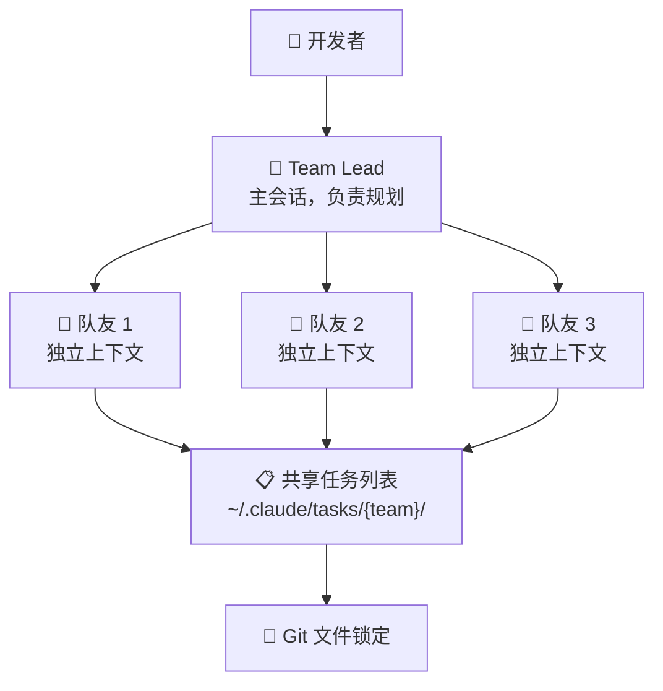

# Claude Agent Teams：当 AI 从「结对编程」进化到「带团队」

**一句话总结：** Anthropic 发布 Claude Opus 4.6，引入 Agent Teams 功能——16 个并行的 AI 智能体用 2 万美元自主写出了能编译 Linux 内核的 C 编译器，标志着 AI 从「副驾驶」进化为「工程团队」。

## 背景：为什么单打独斗的 AI 不够用了

如果你用过 Claude Code、Cursor 或者 GitHub Copilot，一定遇到过这个问题：对话越长，AI 越「健忘」。

这不是错觉。大语言模型（LLM）的上下文窗口就像工作记忆——对话时间一长，早期的决策、代码结构、变量命名就开始模糊。业内称之为「上下文腐烂」（context rot）。

更棘手的是，复杂的工程任务天然需要并行探索。重构一个大型代码库时，你可能需要同时调查前端状态管理、后端 API 设计和数据库性能问题。传统的「一问一答」模式根本应付不来。

行业需要的不是更聪明的副驾驶，而是能协同作战的 AI 团队。

## 核心事件：Opus 4.6 与 Agent Teams 的发布

2026 年 2 月 5 日，Anthropic 发布 Claude Opus 4.6。就在 27 分钟后，OpenAI 推出 GPT-5.3-Codex。这个时间差不是巧合——多智能体 AI 编程的军备竞赛正式打响。

两家公司选择了不同的路线：
- **OpenAI Codex**：强调执行速度，执行任务快 25%，深度集成操作系统
- **Claude Agent Teams**：强调深度推理，支持多日复杂工程任务

Opus 4.6 本身带来了重大升级：
- **100 万 token 上下文窗口**（测试版）
- **12.8 万 token 最大输出**（翻倍）
- 专为长时间智能体工作流设计

但真正的亮点是 **Agent Teams**——一个让多个 Claude 实例像工程团队一样协作的功能。

## 技术解读：Agent Teams 怎么做到的

Agent Teams 和传统的「子智能体」（Subagent）有本质区别：

| 特性 | 子智能体 | Agent Teams |
|------|---------|-------------|
| 上下文 | 与父进程共享 | 每个智能体独立 |
| 通信 | 只能向调用者汇报 | 点对点通信 |
| 生命周期 | 在主会话内 | 独立进程 |
| 适合场景 | 快速工具调用 | 大规模并行探索 |

### 四大核心组件



1. **Team Lead（领队）**：主 Claude Code 会话，负责高层规划、任务分解、生成队友、综合结果。按 `Shift+Tab` 进入「委托模式」，让领队专注协调而非实现。

2. **Teammates（队友）**：独立的 Claude Code 实例，各有自己的进程和上下文窗口。不继承领队的对话历史，但会加载项目配置（如 `CLAUDE.md`）。

3. **Shared Task List（共享任务列表）**：基于文件系统的同步机制，存储在 `~/.claude/tasks/{team-name}/`。追踪任务状态（待处理、进行中、已完成）并管理依赖关系。

4. **Mailbox（邮箱）**：智能体间的异步通信系统。队友可以用 `message` 直接联系特定智能体，或用 `broadcast` 广播给全队——无需经过领队。

### 可视化模式

终端里同时看多个智能体工作需要好的可视化。Claude Code 提供两种模式：

```bash
# 默认：单窗口，Shift+Up/Down 切换视图
claude

# 推荐：tmux 分屏，同时监控所有智能体
claude --teammate-mode tmux
```

分屏模式就像安防监控中心——每个智能体一个窗格，一目了然。

## 实战案例：16 个智能体写出 C 编译器

Anthropic 研究员 Nicholas Carlini 设计了一个极限压力测试：让 16 个 Claude 智能体从零开始写一个 C 编译器，全程无人干预。

**实验设置：**
- 16 个 Claude Opus 4.6 智能体并行运行
- 每个在独立 Docker 容器中
- 「净室」环境——编译期间无法访问互联网
- Git 文件锁定协调协作
- 智能体通过写锁文件认领任务，完成后推送代码

**两周后的结果：**
- 约 2,000 次 Claude Code 会话
- **2 万美元** API 费用
- **10 万行** Rust 代码
- 成功编译 **Linux 6.9** 内核（x86、ARM、RISC-V 三架构）
- **99%** 通过 GCC 测试套件
- 能编译并运行 **Doom**

没有人类参与协调。智能体自主处理任务分解、冲突解决和代码集成。

## 影响分析：这对我们意味着什么

这不是炫技——这是软件开发范式转变的预演。

### 成本账

2 万美元听起来很贵，但算一笔账：
- 几个高级工程师用两周写一个编译器要多少薪资成本？
- 对于复杂的高价值项目，Agent Teams 的 ROI 可能相当可观

### 新的工作模式

开发者们开始尝试一种叫「Vibe Coding」的风格——人类只负责高层意图，AI 负责实现。知名开发者 Steve Yegge 用「Gas Town」来形容这种大规模、混乱但高产的智能体协作。

从「结对编程」到「管理自治团队」，角色在变化。

### 实用场景

1. **多视角代码审查**：不同智能体用不同「镜头」审查同一个 PR——安全、性能、架构一致性同时进行
2. **竞争假设调试**：遇到未知 Bug，让领队派出多个智能体同时调查不同方向
3. **跨层重构**：前端、后端、测试同时由不同智能体更新，保证迁移时的功能一致性
4. **大规模文档消化**：单个上下文窗口装不下的文档量，让智能体分工阅读、汇总报告

## 风险与局限

Agent Teams 目前是「研究预览」状态，粗糙的地方很多。

### 成本问题

「贵得要死」——早期用户的原话。2 万美元的编译器实验说明这不适合日常编码，只适合高价值复杂项目。

### 文件冲突

多个智能体编辑同一文件会出问题。协调层处理的是任务认领，不是代码合并。**精确的任务分解至关重要**——模糊指令会让智能体互相踩脚。

### 会话恢复缺失

长时间运行的操作很脆弱。会话断了，恢复是手动的。

### 配置复杂

实验性功能，需要手动启用：

```bash
export CLAUDE_CODE_EXPERIMENTAL_AGENT_TEAMS=1
```

或在 `~/.claude/settings.json` 中添加：

```json
{
  "env": {
    "CLAUDE_CODE_EXPERIMENTAL_AGENT_TEAMS": "1"
  }
}
```

还需要安装 `tmux` 才能用分屏可视化。

## 与国产大模型的对比

目前，Kimi、通义千问、文心一言等国产大模型尚未提供类似的多智能体协作能力。Agent Teams 代表的「智能体团队」范式，可能是下一个值得关注的方向。

对于国内开发者：
- 可以先用 Claude Code 体验这个范式
- 关注国产模型何时跟进类似功能
- 思考如何将 Agent Teams 与本地化工具链结合

## 常见问题

### Agent Teams 和子智能体（Subagent）有什么区别？

子智能体共享主会话的上下文，只能向调用者汇报——本质是顺序执行。Agent Teams 创建独立进程，每个有隔离的上下文窗口，支持点对点通信。子智能体适合快速工具调用，Agent Teams 适合大规模代码库的并行探索。

### 运行 Agent Teams 要花多少钱？

Opus 4.6 定价：输入 $5/百万 token，输出 $25/百万 token。编译器实验两周花了约 2 万美元（16 个智能体）。日常使用 2-4 个智能体处理小任务，预计 $50-500 不等。

### 现在能用 Agent Teams 吗？

能，但是研究预览版。设置环境变量 `CLAUDE_CODE_EXPERIMENTAL_AGENT_TEAMS=1`，安装 tmux，然后期待一些实验性行为。能用，但不算生产就绪。

### 什么场景最适合用 Agent Teams？

并行探索优于顺序执行的高价值项目：大型代码库重构、多系统迁移、复杂调试、需要多个专业「镜头」的审计。不适合快速修复或成本敏感的日常编码。

### 共享任务列表怎么防止冲突？

`~/.claude/tasks/` 的文件锁定防止多个智能体认领同一任务。但代码文件级别的编辑冲突需要谨慎的任务分解——系统处理任务认领，不处理合并冲突。

## 参考来源

- [Anthropic releases Opus 4.6 with new 'agent teams'](https://techcrunch.com/2026/02/05/anthropic-releases-opus-4-6-with-new-agent-teams/) — TechCrunch, 2026-02-05
- [Sixteen Claude AI agents working together created a new C compiler](https://arstechnica.com/ai/2026/02/sixteen-claude-ai-agents-working-together-created-a-new-c-compiler/) — Ars Technica, 2026-02-06
- [Building a C compiler with a team of parallel Claudes](https://www.anthropic.com/engineering/building-c-compiler) — Anthropic Engineering Blog, 2026-02-05
- [Agent Teams Documentation](https://code.claude.com/docs/en/agent-teams) — Claude Code Docs, 2026-02-05
