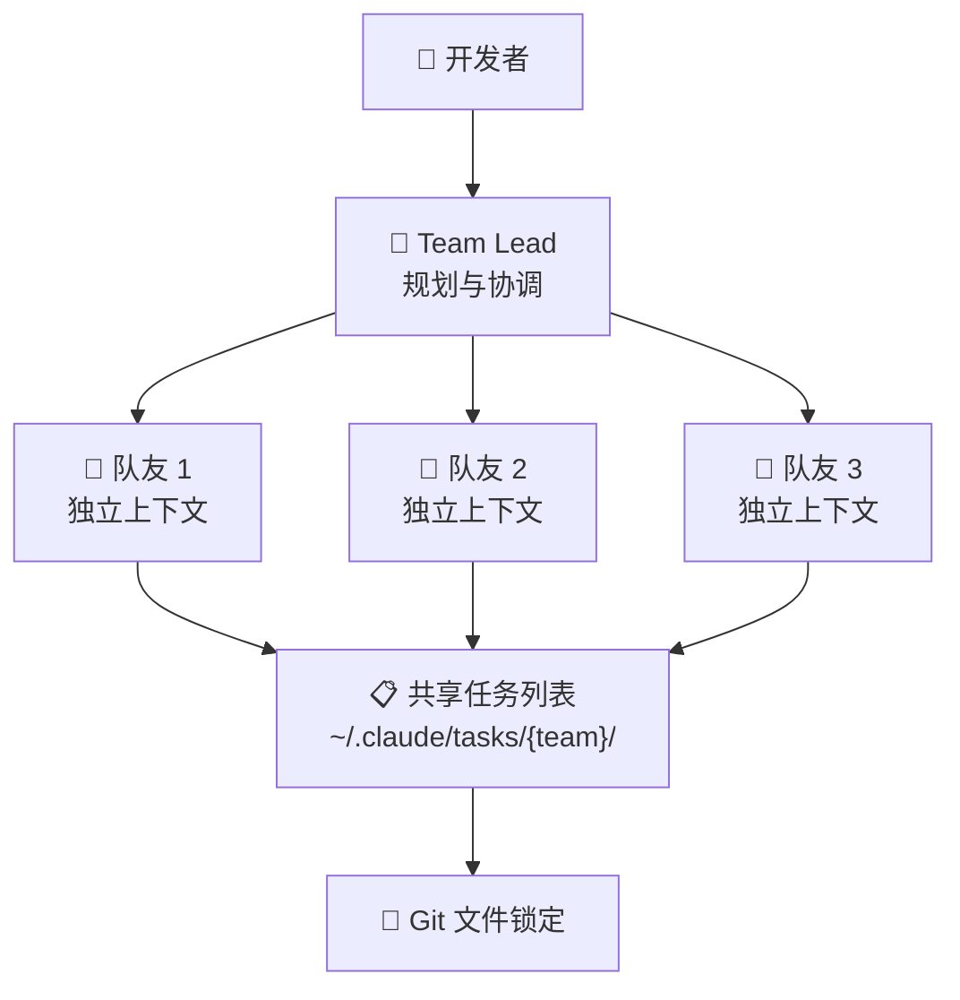

# Claude Agent Teams：Opus 4.6 多智能体协作开发实战

**一句话总结：** Claude Opus 4.6 的 Agent Teams 功能让多个 AI 智能体像工程团队一样并行协作，16 个智能体在无人干预下用 2 万美元写出了能编译 Linux 内核的 10 万行 C 编译器代码。

## 单智能体的天花板

用过 AI 编程助手的开发者都有这个体验：对话越长，AI 越「健忘」。

这不是错觉。大语言模型（LLM）的上下文窗口就像工作记忆——对话时间一长，早期的架构决策、变量命名、文件修改记录就开始模糊。业内称之为「上下文腐烂」（Context Rot）。

更根本的问题是：复杂工程任务天然需要并行。重构一个大型代码库，你需要同时调查前端状态、后端 API、数据库性能和测试覆盖。单个智能体顺序处理这些任务，既慢又浪费上下文窗口。

行业之前尝试了两条路线——全自主智能体（Devin）和行级代码补全（Copilot）。都没解决协调问题。缺的是更接近人类工程团队的工作模式：并行的专业分工 + 共享的项目理解。

## Opus 4.6 发布：Agent Teams 登场

2026 年 2 月 5 日，Anthropic 发布 [Claude Opus 4.6](https://www.anthropic.com/news/claude-opus-4-6)。27 分钟后，OpenAI 推出 GPT-5.3 Codex。多智能体编程的竞赛正式开始。

**Claude Opus 4.6 关键数据：**
- SWE-bench Verified：80.8%（领先所有前沿模型）
- OSWorld：72.7%
- Humanity's Last Exam：53.1%（所有模型最高）
- ARC AGI 2：68.8%（Opus 4.5 的近 2 倍）
- 上下文窗口：100 万 token（beta），此前为 20 万
- 最大输出：12.8 万 token（此前 6.4 万）
- 定价：$5/M 输入，$25/M 输出
- 自适应思考（Adaptive Thinking）：low / medium / high / max 四档

Agent Teams 是这次发布的核心开发者功能——不是 API 能力，而是 Claude Code 内置的多智能体协作系统。

## 技术架构：Agent Teams 怎么运作

Agent Teams 和子智能体（Subagent）有本质区别。子智能体共享主会话上下文，只能向调用者汇报。Agent Teams 创建独立进程，每个有隔离的上下文窗口，支持点对点通信。



### 四大核心组件

| 组件 | 功能 | 细节 |
|------|------|------|
| Team Lead | 高层规划与协调 | 主 Claude Code 会话，`Shift+Tab` 进入委托模式 |
| Teammates | 并行执行任务 | 独立进程，独立上下文，加载 `CLAUDE.md` 配置 |
| Shared Task List | 任务同步 | 文件系统机制，`~/.claude/tasks/` 目录 |
| Mailbox | 智能体间通信 | `message` 点对点 / `broadcast` 广播，无需经过 Lead |

**Compaction API** 是支撑长时间运行的关键。当智能体上下文填满时，服务端自动压缩早期对话，保留关键决策和代码状态。这意味着智能体可以跨越数天工作而不丧失一致性。

### 可视化监控

```bash
# 默认：单窗口，Shift+Up/Down 切换
claude

# 推荐：tmux 分屏，同时监控所有智能体
claude --teammate-mode tmux
```

分屏模式像安防监控中心——每个智能体一个窗格，实时观察进度。

## 极限测试：16 个智能体从零写 C 编译器

Anthropic 研究员 Nicholas Carlini 的压力测试堪称 Agent Teams 的「发布会 demo」。

**实验设置：**
- 16 个 Opus 4.6 智能体并行，各在独立 Docker 容器
- 净室环境——编译期间无互联网
- Git 文件锁定协调，智能体写锁文件认领任务

**两周后结果：**
- 约 2,000 次 Claude Code 会话
- **$20,000** API 费用
- **10 万行** Rust 代码
- 成功编译 **Linux 6.9** 内核（x86、ARM、RISC-V）
- **99%** GCC 测试套件通过率
- 能编译并运行 **Doom**

全程无人类协调。智能体自主处理任务分解、冲突解决和代码集成。[Anthropic 工程博客](https://www.anthropic.com/engineering/building-c-compiler)记录了完整过程。

## 实战场景

Agent Teams 在「并行探索优于顺序执行」的场景最有价值：

**多视角代码审查。** 不同智能体用不同视角审查同一个 PR——安全、性能、架构一致性同时进行。传统流程中这需要多轮 review，现在一轮完成。

**竞争假设调试。** 遇到难以复现的 Bug，Lead 派出多个智能体同时调查不同方向。一个查内存泄漏，一个查竞态条件，一个查外部依赖兼容性。

**跨层重构。** 前端、后端、测试由不同智能体同步更新。在微服务迁移中，这种并行能力直接影响项目周期。

**大规模文档消化。** 单个 100 万 token 窗口装不下的文档量（比如整个 Kubernetes 代码库），让智能体分工阅读、汇总报告。

## 成本分析

$20,000 写一个编译器贵吗？看怎么算。

几个高级工程师用两周写一个能编译 Linux 内核的 C 编译器——先不说可行性——薪资成本远超 $20,000。对高价值、高复杂度项目，Agent Teams 的 ROI 可能相当可观。

日常使用的成本预估：

| 场景 | 智能体数 | 预估费用 |
|------|---------|---------|
| 快速调试 | 2 个 | $50-100 |
| 中型重构 | 3-4 个 | $200-500 |
| 大型项目 | 8-16 个 | $5,000-20,000 |

Prompt 缓存可节省高达 90%，批量处理可节省 50%。

## 风险与局限

Agent Teams 目前是研究预览版，粗糙之处不少。

**文件冲突。** 多个智能体编辑同一文件会出问题。协调层处理的是任务认领，不是代码合并。**精确的任务分解至关重要**——模糊指令让智能体互相踩脚。

**会话恢复。** 长时间运行的操作很脆弱。会话断了，恢复是手动的。

**配置门槛。** 需要手动启用实验性功能：

```bash
export CLAUDE_CODE_EXPERIMENTAL_AGENT_TEAMS=1
```

还需要安装 `tmux` 才能用分屏可视化。

**成本控制。** 没有内置的费用上限机制。跑偏的智能体可能烧钱，需要人工监控。

## 与 GPT-5.3 Codex 的对比

同一天发布的两个模型，走了不同的路线：

| 维度 | Claude Opus 4.6 | GPT-5.3 Codex |
|------|-----------------|---------------|
| SWE-bench Verified | 80.8% | 80.0% |
| OSWorld | 72.7% | 64.7% |
| Terminal-Bench 2.0 | 65.4% | 77.3% |
| 风格 | 天花板更高，波动更大 | 天花板稍低，更稳定 |
| 多智能体 | Agent Teams（Claude Code 原生） | Codex Mac App（任务管理器） |
| 适合 | 开放性难题、深度推理 | 稳定的自主执行 |

开发者社区的共识是：难题选 Opus，求稳选 Codex。

## 对国内开发者的影响

目前 Kimi、通义千问、文心一言等国产模型尚未提供类似的多智能体协作能力。Agent Teams 代表的「智能体团队」范式值得关注：

- Claude Code 可通过 API 使用，国内开发者可以体验这个范式
- 关注国产模型何时跟进类似功能（DeepSeek 的推理能力已接近前沿）
- 思考如何将 Agent Teams 与本地化工具链结合

## 常见问题

### Agent Teams 和子智能体有什么区别？

子智能体共享主会话上下文，只能向调用者汇报——本质是顺序执行。Agent Teams 创建独立进程，每个有隔离的上下文窗口，支持点对点通信和广播。子智能体适合快速工具调用，Agent Teams 适合大规模并行探索。

### 运行 Agent Teams 要花多少钱？

Opus 4.6 定价 $5/M 输入、$25/M 输出。编译器实验（16 个智能体，两周）花了约 $20,000。日常 2-4 个智能体处理中型任务，预计 $50-500。Prompt 缓存最高省 90%。

### 现在能用吗？

能，但是研究预览版。设置 `CLAUDE_CODE_EXPERIMENTAL_AGENT_TEAMS=1` 环境变量，安装 tmux，然后接受一些实验性行为。能用，不算生产就绪。

### 100 万 token 上下文窗口意味着什么？

每个智能体可以在内存中保持一个中大型代码库。4 个智能体的团队总共覆盖 400 万 token。配合 Compaction API 的无限对话能力，智能体可以持续工作数天而不丢失早期决策。

### 什么场景最值得用 Agent Teams？

并行探索优于顺序执行的高价值项目：大型代码库重构、多系统迁移、需要多角度分析的复杂调试、多层同步更新的微服务改造。不适合快速修复或成本敏感的日常编码。

## 参考来源

- [Anthropic releases Claude Opus 4.6](https://www.anthropic.com/news/claude-opus-4-6) — Anthropic, 2026-02-05
- [Building a C compiler with parallel Claudes](https://www.anthropic.com/engineering/building-c-compiler) — Anthropic Engineering Blog, 2026-02-05
- [Sixteen Claude AI agents created a C compiler](https://arstechnica.com/ai/2026/02/sixteen-claude-ai-agents-working-together-created-a-new-c-compiler/) — Ars Technica, 2026-02-06
- [Codex vs Opus vibe check](https://every.to/vibe-check/codex-vs-opus) — Every.to, 2026-02
- [Agent Teams Documentation](https://code.claude.com/docs/en/agent-teams) — Claude Code Docs, 2026-02-05
