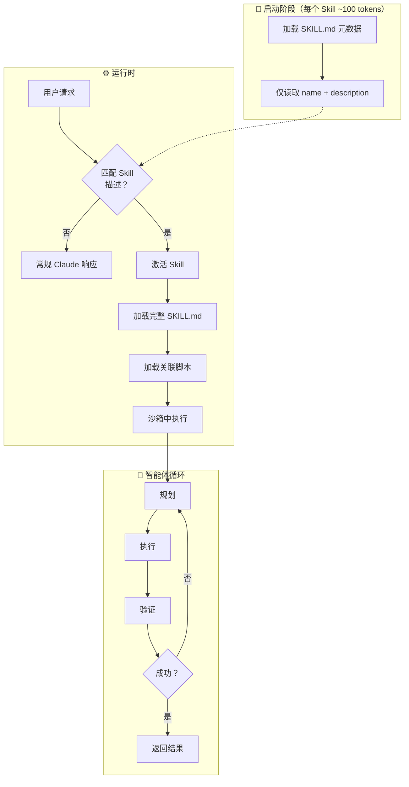

# Claude Code Skills 架构解析：开发者正在变成 AI 军团的指挥官

**一句话总结：** 开发者的角色正从「写代码的人」转变为「管理 AI 智能体集群的架构师」——而 Cowork 发布 48 小时内被攻破，说明这条路远比想象中凶险。

## 自动补全的时代结束了

2025 年之前，AI 编程工具本质上是「高级自动补全」。Copilot 帮你续写下一行，Cursor 预测你的 Tab 键。开发者依然是手艺人，一个字符一个字符地敲代码。

2025 年 11 月，Anthropic 发布 Claude Opus 4.5，SWE-bench Verified 得分 80.9%。**游戏规则变了。**

AI 不再只是「建议代码」，而是开始「自主执行整个开发流程」。

这个转折来得太快，以至于行业还没来得及发明新词汇——于是 Andrej Karpathy 造了一个：**氛围编程（Vibe Coding）**。你只需要告诉 Claude「把这个界面改成 90 年代赛博朋克风格」，它就会自己写代码、跑测试、发现问题、修复 bug，直到「氛围对了」。

**Claude Code 关键数据：**
- 年化收入（ARR）：10 亿美元（2026 年 1 月达成，仅用 6 个月）
- 企业渗透率：财富 100 强中 70% 已部署
- 代码贡献：GitHub 公开提交中 4% 由 AI 生成
- VS Code AI 插件日安装量：从 1770 万增长到 2900 万（2025 年末至 2026 年初）

这个增速超过了 Slack，超过了 Zoom。

## Skills 架构：让 AI 学会「按需加载」

Claude Code 真正的技术突破不是模型本身，而是 **Skills 架构**。

传统 IDE 插件需要用户主动调用——敲个 `/deploy` 才会触发部署脚本。但 Skills 是「模型调用型」的：Claude 自己判断什么时候该用什么工具。

这套设计叫**渐进式披露（Progressive Disclosure）**：

1. **启动时**：只加载每个 Skill 的名称和描述（约 100 tokens）
2. **匹配时**：Claude 判断用户意图是否对应某个 Skill
3. **执行时**：才读取完整指令和脚本

好处显而易见：一个智能体可以「知道」上百个工具的存在，却不会撑爆上下文窗口。

## MCP 协议：AI 世界的 USB-C

Skills 解决了「Claude 怎么知道该干什么」的问题，**模型上下文协议（Model Context Protocol，MCP）** 解决的是「Claude 怎么连接外部系统」。

Anthropic 把 MCP 比作「AI 应用的 USB-C」——一个通用接口标准，让 Claude Code 可以直接查询 PostgreSQL、管理 Jira 工单、读取 Salesforce 客户数据，不需要为每个系统写定制 API 集成。

| 传统方式 | MCP 方式 |
|---------|---------|
| 每个数据源写一套集成代码 | 一次实现，处处可用 |
| API 变更需要手动适配 | 协议层抽象，上层无感 |
| 工具孤岛，无法组合 | 一个 Skill 调用多个 MCP 服务器 |

举个例子：一个「客户支持」Skill 可以同时调用 Salesforce 查客户信息、Jira 查工单历史、Slack 发通知——全程不需要开发者写一行胶水代码。

## 「一年的架构工作，一小时复现」

这套系统到底有多强？看几个真实案例：

**案例一：Claude Cowork 的诞生**

2026 年 1 月 12 日，Anthropic 发布了 Claude Cowork——一个面向知识工作者的桌面应用。开发团队只有 **4 个人**，开发周期 **10 天**。

Anthropic Claude Code 负责人 Boris Cherny 在采访中确认：「所有代码都是 Claude 写的。」

**案例二：Google 工程师的震惊**

2026 年 1 月，西雅图的一场技术聚会上，一位 Google 首席工程师公开表示：「Claude Code 用一个小时复现了我们一年的架构工作。」

**案例三：HashiCorp 创始人的转变**

Mitchell Hashimoto（HashiCorp 创始人）在 2026 年 2 月发表了「我的 AI 采用之旅」，建议开发者「放弃聊天机器人思维」，拥抱智能体。他的方法论：先让 AI 复现你手动做过的工作，建立信任，再逐步放手。

行业已经有人把这个时刻比作「古登堡印刷术」「缝纫机发明」「照相机诞生」——软件生产从手工作坊变成工业化流水线。

## 48 小时攻破：智能体安全的警钟

但故事不只有光明面。

Claude Cowork 发布两天后，安全公司 **PromptArmor** 就演示了一个攻击：在文件中隐藏恶意指令（间接提示注入），欺骗 Claude 将用户的敏感文件发送到攻击者服务器。

更讽刺的是，攻击成功的原因之一是 **Anthropic 自己的 API 域名被列入了白名单**。

这暴露了智能体系统的根本矛盾：

> 智能体要有用，就必须拥有广泛权限（读文件、发网络请求、执行代码）。但这些权限本身就是攻击面。

传统软件里，用户是「操作者」，攻击需要欺骗用户本人。智能体时代，AI 是「操作者」，攻击只需要欺骗 AI——而 AI 比人类更容易被精心构造的文本欺骗。

有安全研究员直接说：**「AI 智能体就是新型内部威胁。」**

而 GUI 版的 Cowork 比命令行版的 Claude Code 更危险——后者至少让用户能看到 Claude 在执行什么命令，前者把一切都藏在「友好界面」背后。

## 氛围编程的代价：技能退化争论

除了安全，另一个争议是：**如果 Claude 写了 100% 的代码，开发者的能力会怎样？**

支持者认为，这是解放。就像摄影师不需要手工研磨镜片，开发者不需要记住每个 API 的参数顺序。

反对者担心，这是技能退化。当你不再亲手写代码，你还能准确评估 AI 的输出质量吗？能发现隐藏的 bug 吗？能在 AI 失灵时接手吗？

这个问题目前没有答案。但市场已经用脚投票了——日均 AI 编程插件安装量翻了近一倍。

## 对国内开发者意味着什么

Claude Code 目前在国内的可用性受限（需要特定渠道访问），但架构思路值得关注：

1. **Skills 架构可以复刻**：渐进式披露 + 模型自主调用，这套设计不依赖特定模型。国产大模型（Qwen、Kimi、GLM）完全可以实现类似机制。

2. **MCP 是开放标准**：Anthropic 把 MCP 设计成开放协议，意味着任何模型理论上都能接入。如果国内厂商跟进，生态可以共享。

3. **安全问题更需警惕**：国内应用如果采用类似的智能体架构，48 小时被攻破的故事可能重演。提示注入防护、权限最小化、执行沙箱——这些不是可选项。

## 常见问题

### Claude Code Skills 和传统 IDE 插件有什么区别？

传统插件需要用户主动调用（斜杠命令、菜单点击）。Skills 是「模型调用型」——AI 根据对话上下文自主判断何时使用。启动时只加载元数据（每个 Skill 约 100 tokens），激活时才读取完整指令，这让一个智能体可以管理上百个工具而不撑爆上下文窗口。

### 什么是氛围编程（Vibe Coding）？

由 Andrej Karpathy 提出，指开发者只描述高层意图或视觉风格（「让这个应用看起来像赛博朋克」），AI 自主完成所有实现细节——跨多个文件写代码、运行测试、重构，直到效果符合预期。争议在于：如果开发者不再写代码，评估和调试 AI 输出的能力会不会退化。

### PromptArmor 发现的安全漏洞说明了什么？

这个漏洞表明：智能体系统的权限模型与传统软件根本不同。AI 需要广泛权限才能有用（文件访问、网络请求、代码执行），但这些权限创造了人类驱动工作流中不存在的攻击面。GUI 界面还会进一步掩盖风险——用户看不到 AI 正在执行什么操作。

## 参考来源

- [Claude (language model) - Wikipedia](https://en.wikipedia.org/wiki/Claude_(language_model)) — Wikipedia，2026-02-01
- [The Claude Code and Cowork Moment](https://gaiinsights.substack.com/) — GAI Insights，2026-01-15
- [Anthropic's Claude Code is having its ChatGPT moment](https://uncoveralpha.com/claude-code-chatgpt-moment/) — UncoverAlpha，2026-01-20
- [Claude Code Handbook: Agent Skills](https://nikiforovall.blog/claude-code-skills/) — Nikiforov Tech Blog，2026-01-10
- [Claude Cowork Security Flaw Discovered](https://byteiota.com/claude-cowork-security/) — ByteIota，2026-01-14
