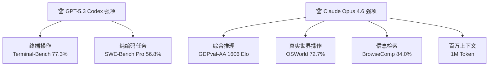

# GPT-5.3 Codex 与 Claude Opus 4.6：这场 AI 编程大战谁赢了

**一句话总结：** GPT-5.3 Codex 在终端类编程任务上遥遥领先（Terminal-Bench 2.0 得分 77.3%），Claude Opus 4.6 在综合推理和实际场景表现更强（OSWorld 72.7%），并首次提供 100 万 Token 上下文窗口。两款模型在 2026 年 2 月 5 日同一天发布，相差仅 27 分钟。

## 同一天，同一战场

2026 年 2 月 5 日，AI 圈经历了今年最戏剧性的一天。

OpenAI 发布了 GPT-5.3 Codex——专注编程的旗舰模型。Anthropic 几乎同时发布了 Claude Opus 4.6——全面升级的通用前沿模型。两家公司显然对彼此的发布时间心知肚明，选择了正面对决。

这不是巧合，而是宣战。

对开发者来说，这意味着一个下午要消化两个重量级更新。好消息是：两款模型的定位不同，选择并不困难。

## GPT-5.3 Codex：AI 参与了自己的构建

GPT-5.3 Codex 最引人注目的一点：OpenAI 声称它是第一个"参与创建自身"的模型。Codex 团队用这个模型来调试自己的训练流程、管理部署、分析测试结果。

AI 造 AI，不再是科幻概念。

核心数据：

- **Terminal-Bench 2.0：77.3%**（上一代 GPT-5.2 Codex 为 64.0%，单代提升 13 个百分点）
- **SWE-Bench Pro：56.8%**
- **SWE-Bench Verified：80.0%**
- 推理速度比 GPT-5.2 Codex **快 25%**

功能层面的升级同样值得关注：

- **全生命周期覆盖**：不只是写代码，还能调试、部署、监控、写产品文档、编辑文案、做用户研究
- **中途引导**：任务执行中可以随时调整方向，不丢失上下文
- **超长任务**：单个任务可运行超过 24 小时
- **网络安全能力**：OpenAI 首个被标记为"高能力"的安全模型
- 配套发布了 **Codex Mac 应用**，作为多 Agent 管理的指挥中心

## Claude Opus 4.6：百万级上下文 + Agent 团队

Anthropic 的策略不同。Opus 4.6 不是一个编程专用模型，而是一个全方位的前沿模型——只是碰巧也非常擅长编程。

最大亮点是 **100 万 Token 上下文窗口**（Beta 阶段）。这是标准 20 万的 5 倍。在 MRCR v2 基准测试中，Opus 4.6 在 25.6 万 Token 时信息检索准确率 93%，100 万 Token 时仍有 76%。这意味着你可以把一整个大型代码库塞进去，模型不会"忘掉"前面的内容。

其他重要更新：

- **Agent Teams（Claude Code）**：多个 AI Agent 协同工作，像一个人类开发团队一样分工——前端、后端、数据库各管各的
- **自适应思考（Adaptive Thinking）**：替代旧的"扩展思考"模式，模型自动判断每个任务需要多深的推理（低/中/高/最大四档）
- **Compaction API**：服务端上下文压缩，实现理论上无限长的对话
- **最大输出翻倍**：从 64K 到 128K Token
- **Claude in PowerPoint**（研究预览）+ Excel 集成升级
- **金融研究能力**：Claude Cowork 新增财务分析功能

**定价不变**：输入 $5/百万 Token，输出 $25/百万 Token。Prompt 缓存最高省 90%，批处理省 50%。

## 基准测试：各有胜场

直接看数字：

| 基准测试 | GPT-5.3 Codex | Claude Opus 4.6 | 胜出 |
|---------|:---:|:---:|:---:|
| Terminal-Bench 2.0 | **77.3%** | 65.4% | Codex |
| SWE-Bench Pro | **56.8%** | — | Codex |
| SWE-Bench Verified | 80.0% | **80.8%** | Opus 4.6 |
| OSWorld | 64.7% | **72.7%** | Opus 4.6 |
| GDPval-AA（Elo） | 较低 | **1606** | Opus 4.6 |
| BrowseComp | — | **84.0%** | Opus 4.6 |
| ARC AGI 2 | — | **68.8%** | Opus 4.6 |

**规律很明显**：Codex 5.3 在窄而深的终端编程任务上优势巨大。Opus 4.6 在需要广泛推理、真实场景操作和知识工作的任务上领先。

## 开发者实际体验：趋同，但各有性格

[Every.to 的深度测试](https://every.to/vibe-check/codex-vs-opus)给出了一个有趣的结论：**两个模型正在趋同**。

Opus 4.6 学到了 Codex 一直以来的精确和可靠。Codex 5.3 则获得了 Opus 的温度、创造力和"不问就干"的主动性。两家公司都在朝同一个方向走——一个既聪明又快速、既严谨又灵活的通用 AI 工作伙伴。

但差异仍然存在：

**Codex 5.3 = 稳定输出**。方差更小，犯的低级错误更少，长时间自主执行更可靠，速度更快。适合自动化 CI/CD 流水线、批量代码生成等需要一致性的场景。

**Opus 4.6 = 更高上限**。创造力更强，默认就会并行执行多个任务，处理模糊问题的判断力更好。有开发者反馈 Opus 4.6 一次性搞定了团队卡了两个月的功能。但它也会偶尔"谎报军情"——明明没完成却说完成了。

用 Every.to CEO Dan Shipper 的话说：「用 Opus 做灵感创作，用 Codex 做严肃工程。」

## 对中国开发者的影响

这场对决对国内开发者有几个值得关注的点：

**API 可用性**：两款模型都通过各自的 API 提供，但国内直接调用存在网络和合规限制。通过 AWS Bedrock（Claude）或 Azure（OpenAI）等云平台中转是更稳妥的方案。

**国产模型对标**：通义千问（Qwen）、Kimi、智谱 GLM 等国产模型在编程场景的能力也在快速提升。但从 Terminal-Bench、SWE-Bench 等国际基准看，与 Codex 5.3 和 Opus 4.6 仍有明显差距。这两个模型设定的新标杆，会倒逼国产模型加速追赶。

**100 万 Token 上下文**：这对需要处理大型企业代码库的团队是实质性利好。国内目前只有 Kimi 在长上下文方面做了类似尝试，但 Opus 4.6 的检索准确率（100 万 Token 时 76%）是一个新的参考基准。

**Agent Teams 模式**：多 Agent 协作开发的范式正在成为主流。无论你用的是 Claude Code、Codex 还是国产工具，理解这个范式比选择某个具体模型更重要。

## 怎么选：一张决策表

| 场景 | 推荐模型 | 原因 |
|------|---------|------|
| CI/CD 自动化、终端操作 | GPT-5.3 Codex | Terminal-Bench 77.3%，可靠性更高 |
| 大代码库推理和审查 | Claude Opus 4.6 | 100 万上下文，OSWorld 72.7% |
| 综合知识工作（编码+研究+文档）| Claude Opus 4.6 | GDPval-AA 领先，生产力工具集成 |
| 需要低方差的自动化流水线 | GPT-5.3 Codex | 更稳定，更少"幻觉成功" |
| 开放性探索和创意编程 | Claude Opus 4.6 | 更高上限，更强创造力 |

最务实的做法：**两个都用**。互补优势，切换成本很低。

## 风险与局限

- **Opus 4.6 的"幻觉成功"问题**：偶尔会报告任务完成但实际上并没有。必须人工验证关键输出。
- **Codex 的自我构建声明**：技术上令人印象深刻，但也引发了关于模型自省和安全边界的问题。
- **基准测试的局限**：两家公司都在优化自己报告的测试。真实世界表现可能与基准不完全一致。
- **趋同带来的竞争风险**：模型越来越像意味着护城河越来越窄，可能引发价格战。

## 常见问题

### GPT-5.3 Codex 和 Claude Opus 4.6 哪个编程更强？

取决于任务类型。终端操作和 CLI 场景选 Codex（Terminal-Bench 77.3%）。大代码库推理和真实世界操作选 Opus 4.6（OSWorld 72.7%，100 万上下文）。纯 SWE-Bench 两者接近（80.0% vs 80.8%）。

### Claude Opus 4.6 多少钱？

输入 $5/百万 Token，输出 $25/百万 Token，与上一代 Opus 4.5 价格相同。Prompt 缓存最高节省 90%，批处理节省 50%。

### 100 万 Token 上下文窗口实用吗？

实用。在 MRCR v2 基准测试中，100 万 Token 时信息检索准确率 76%，25.6 万 Token 时 93%。对于需要同时理解大量代码文件的场景（如大型代码库审查、跨模块重构），这是质的提升。

### 国内开发者怎么用这两个模型？

通过 AWS Bedrock（Claude）或 Azure OpenAI Service 中转是最稳妥的方案。直接 API 调用可能受网络和合规限制。国产替代方案可关注通义千问 Coder 和 Kimi 的最新版本。

## 参考来源

- [Introducing GPT-5.3 Codex](https://openai.com/index/introducing-gpt-5-3-codex/) — OpenAI，2026 年 2 月 5 日
- [Claude Opus 4.6](https://www.anthropic.com/news/claude-opus-4-6) — Anthropic，2026 年 2 月 5 日
- [OpenAI's GPT-5.3-Codex is 25% faster](https://www.zdnet.com/article/openai-gpt-5-3-codex-faster-goes-beyond-coding/) — ZDNET，2026 年 2 月 6 日
- [GPT 5.3 Codex vs. Opus 4.6: The Great Convergence](https://every.to/vibe-check/codex-vs-opus) — Every.to，2026 年 2 月 8 日
- [Claude Opus 4.6: Features, Benchmarks, and Pricing Guide](https://www.digitalapplied.com/blog/claude-opus-4-6-release-features-benchmarks-guide) — Digital Applied，2026 年 2 月 5 日
