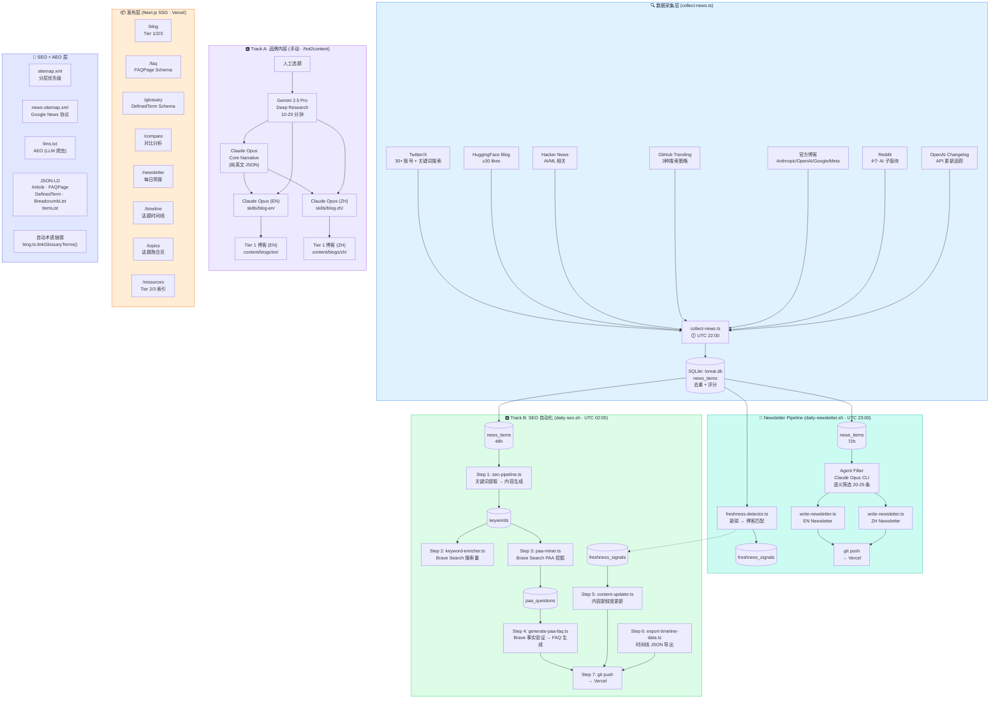
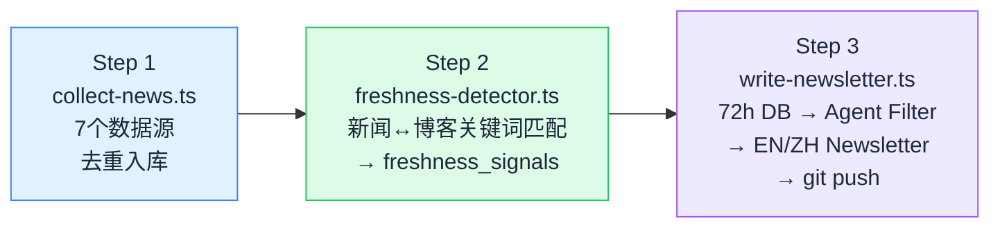
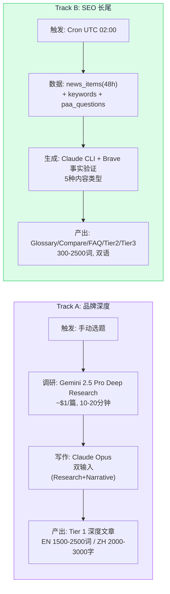
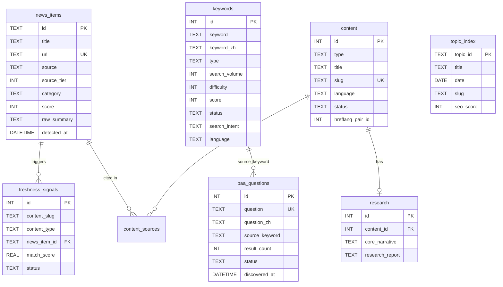
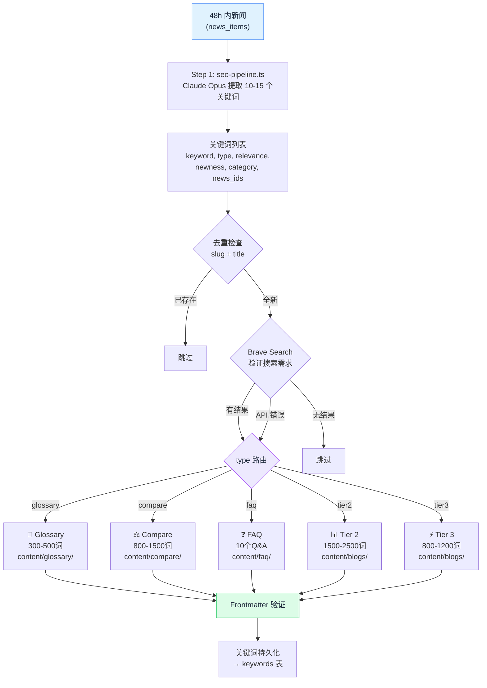
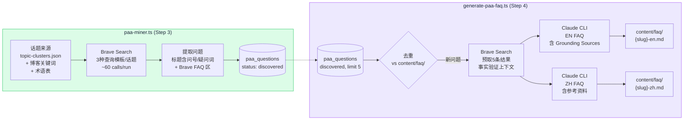
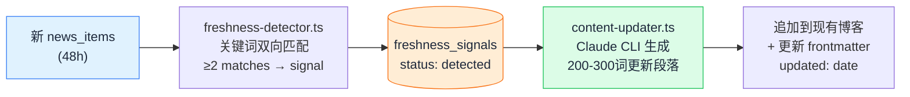
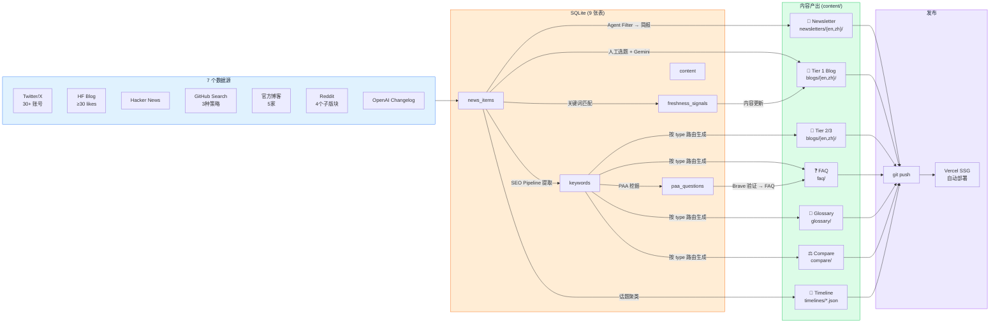

# LoreAI Pipeline Architecture

> Last updated: 2026-02-19

## Overview: Dual-Track Content Strategy

LoreAI 采用双轨内容策略，共享同一个 SQLite 数据层 (`loreai.db`)，由三个 cron 作业驱动，产出六种内容类型。

- **Track A (品牌深度):** 人工选题 → Gemini Deep Research → Core Narrative → Claude Opus 双语博客。每周 1-2 篇 Tier 1。
- **Track B (SEO 长尾):** 自动从 news_items 提取关键词 → 按类型路由生成 → PAA 问题挖掘 → 内容新鲜度更新 → git push 发布。每天 5-10 篇。
- **Newsletter:** 每日新闻聚合 → 智能筛选 → 双语 AI 简报。

## 整体架构图



## Cron 作业 — 三条流水线

### 流水线 1: daily-newsletter.sh (UTC 22:00 采集 / UTC 23:00 生成)



- Step 1 失败 → 整个流水线退出
- Step 2 失败 → 继续（non-fatal）
- Step 3 包含 git add + commit + push

### 流水线 2: daily-seo.sh (UTC 02:00)

```mermaid
flowchart LR
    S1["Step 1<br/>seo-pipeline.ts<br/>新闻→关键词→内容"] --> S2["Step 2<br/>keyword-enricher.ts<br/>Brave 搜索量"]
    S2 --> S3["Step 3<br/>paa-miner.ts<br/>Brave PAA 挖掘"]
    S3 --> S4["Step 4<br/>generate-paa-faq.ts<br/>Brave事实验证→FAQ"]
    S4 --> S5["Step 5<br/>content-updater.ts<br/>新鲜度更新"]
    S5 --> S6["Step 6<br/>export-timeline-data.ts<br/>时间线JSON"]
    S6 --> S7["Step 7<br/>git push<br/>content/ only"]

    style S1 fill:#e0f2fe,stroke:#3b82f6,color:#1e293b
    style S2 fill:#dcfce7,stroke:#22c55e,color:#1e293b
    style S3 fill:#ede9fe,stroke:#a855f7,color:#1e293b
    style S4 fill:#ffedd5,stroke:#f97316,color:#1e293b
    style S5 fill:#ccfbf1,stroke:#14b8a6,color:#1e293b
    style S6 fill:#fef9c3,stroke:#eab308,color:#1e293b
    style S7 fill:#fecdd3,stroke:#f43f5e,color:#1e293b
```



- Step 1 失败 → 整个流水线退出
- Steps 2-6 失败 → 继续（non-fatal，|| echo warning）
- Step 7: `git add content/` → 只提交 content/ 目录（不含 output/、logs/、loreai.db）

### 流水线 3: /hot2content (手动触发)

```
Step 1: trend-scout (Sonnet) → input/topic.json
Step 2: dedup-checker (Haiku) → PASS/UPDATE/SKIP
Step 3: researcher (Sonnet) → Gemini Deep Research → output/research-report.md
Step 4: narrative-architect (Opus) → output/core-narrative.json (纯英文)
Step 5: writer-en + writer-zh (Opus, 并行) → output/blog-en.md + blog-zh.md
Step 6: seo-reviewer (Sonnet) → output/seo-review.md
Step 7: 更新 output/topic-index.json
Step 8: 汇总报告
```

## Track A vs Track B 详细对比



| 维度 | Track A | Track B |
|------|---------|---------|
| 触发方式 | 手动 (`/hot2content`) | 自动 Cron |
| 调研 | Gemini 2.5 Pro Deep Research | news_items 48h 窗口 |
| 写作模型 | Claude Opus (via subagents) | Claude via `claude -p` CLI |
| 事实验证 | 深度调研本身 | Brave Search 预取 |
| 产出 | Tier 1 深度文章 | Glossary/Compare/FAQ/Tier2/Tier3 |
| 字数 | EN 1500-2500 / ZH 2000-3000 | 300-2500 (按类型) |
| 频率 | 每周 1-2 篇 | 每天 5-10 篇 |
| 成本 | ~$1/篇 (Gemini) | 免费 (Claude Max + Brave Free) |
| 目标 | 品牌权威 + E-E-A-T | 搜索流量 + 长尾覆盖 |

## 数据库 Schema (9 张表)



### 关键状态流转

| 表 | 字段 | 流转 |
|----|------|------|
| `keywords` | `status` | `backlog` → `used` (被 seo-pipeline 消费后) |
| `paa_questions` | `status` | `discovered` → `published` / `duplicate` / `error` |
| `freshness_signals` | `status` | `detected` → `processed` / `skipped` |
| `content` | `status` | `draft` → `published` |

## SEO Pipeline: 关键词到内容的路由



### 多样性控制规则

| 规则 | 约束 |
|------|------|
| 公司多样性 | 同一公司最多 5 个关键词，至少覆盖 3 家 |
| 类别配额 | models: 2-3, tools: 2-3, infra: 1-2, opensource: 1-2, applications: 1-2, safety: 0-1 |
| 类型混合 | glossary + compare + faq + tier2 + tier3 |
| 评分排序 | `relevance × newness` 降序，取前 10 |

## PAA 问题挖掘 → FAQ 生成



## 内容新鲜度更新



## 数据流: 从新闻到页面



## 内容目录结构

```
content/
├── blogs/
│   ├── en/                     ← 所有英文博客 (Tier 1/2/3)
│   └── zh/                     ← 所有中文博客 (Tier 1/2/3)
├── newsletters/
│   ├── en/                     ← YYYY-MM-DD.md (每日)
│   └── zh/                     ← YYYY-MM-DD.md (每日)
├── faq/                        ← {slug}-en.md / {slug}-zh.md
├── glossary/                   ← {slug}-en.md / {slug}-zh.md
├── compare/                    ← {slug}-en.md / {slug}-zh.md
├── timelines/                  ← {topic-slug}.json (SSG 数据)
└── topic-clusters.json         ← 8 个话题聚类定义
```

### 话题聚类 (topic-clusters.json)

| Slug | 话题 | 用途 |
|------|------|------|
| `claude-code` | Claude Code | Timeline + Topics hub |
| `claude-opus` | Claude Opus 4.6 | Timeline + Topics hub |
| `gpt-codex` | GPT-5.3 Codex | Timeline + Topics hub |
| `ai-agents` | AI Agents | Timeline + Topics hub |
| `model-comparison` | 模型对比 | Timeline + Topics hub |
| `ai-coding-tools` | AI 编程工具 | Timeline + Topics hub |
| `context-window` | 上下文窗口 | Timeline + Topics hub |
| `ai-video` | AI 视频制作 | Timeline + Topics hub |

## SEO + AEO 层

| 组件 | 路径 | 功能 |
|------|------|------|
| sitemap.xml | `/sitemap.xml` | 分层优先级: Tier 1 = 0.9, Tier 2 = 0.7, Tier 3 = 0.5 |
| news-sitemap.xml | `/news-sitemap.xml` | Google News 协议: 30天内 Newsletter + 48h 内 Tier 1/2 |
| llms.txt | `/llms.txt` | AEO: 所有内容 URL 列表，供 LLM 爬虫索引 |
| robots.txt | `/robots.txt` | 允许: GPTBot, ClaudeBot, PerplexityBot, Applebot; 禁止: Bytespider, CCBot |
| JSON-LD | 每个页面 | Article, FAQPage, DefinedTerm, BreadcrumbList, ItemList |
| 自动术语链接 | 博客渲染时 | `blog.ts:linkGlossaryTerms()` 自动在博客正文中超链接术语表词条 |

## 脚本与文件对应关系

### Cron 自动脚本

| 脚本 | 功能 | 输入 | 输出 | Cron |
|------|------|------|------|------|
| `collect-news.ts` | 新闻采集 (7源) | APIs | `news_items` | UTC 22:00 |
| `freshness-detector.ts` | 新鲜度信号检测 | `news_items` + blog frontmatter | `freshness_signals` | UTC 23:00 |
| `write-newsletter.ts` | 简报生成 + 推送 | `news_items` (72h) | `newsletters/{en,zh}/` → git push | UTC 23:00 |
| `seo-pipeline.ts` | 关键词提取 → 内容生成 | `news_items` (48h) | `glossary/`, `faq/`, `compare/`, `blogs/` + `keywords` | UTC 02:00 Step 1 |
| `keyword-enricher.ts` | 搜索量/难度评估 | `keywords` (backlog) | 更新 `search_volume`, `difficulty` | UTC 02:00 Step 2 |
| `paa-miner.ts` | PAA 问题挖掘 | topic-clusters + blog kw + glossary | `paa_questions` | UTC 02:00 Step 3 |
| `generate-paa-faq.ts` | PAA→FAQ (Brave 事实验证) | `paa_questions` (discovered) | `faq/{slug}-{en,zh}.md` | UTC 02:00 Step 4 |
| `content-updater.ts` | 内容新鲜度更新 | `freshness_signals` (detected) | 修改现有 blog MD | UTC 02:00 Step 5 |
| `export-timeline-data.ts` | 时间线 JSON 导出 | `news_items` + `topic-clusters.json` | `timelines/*.json` | UTC 02:00 Step 6 |

### Track A 手动脚本

| 脚本 | 功能 | 输入 | 输出 |
|------|------|------|------|
| `orchestrator.ts` | Tier 1 完整流水线 | `input/topic.json` | Research + Narrative + EN/ZH Blog |
| `research-gemini-deep.py` | Gemini 深度调研 | 主题关键词 | `output/research-report.md` |
| `validate-narrative.ts` | Core Narrative 验证 | `output/core-narrative.json` | Pass/Fail |
| `validate-blog.ts` | Blog Frontmatter 验证 | `content/blogs/` | Pass/Fail + 错误列表 |

### 辅助脚本

| 脚本 | 功能 |
|------|------|
| `extract-faq.ts` | 从博客内容提取 FAQ |
| `extract-glossary.ts` | 从博客内容提取术语 |
| `extract-compare.ts` | 从博客内容提取对比表 |
| `extract-keywords.ts` | 从调研报告提取关键词 |
| `generate-tier2.ts` | 独立 Tier 2/3 生成 |
| `twitter-collector.ts` | 独立 Twitter 采集 |
| `generate-roundup.ts` | 月度总结 (Phase 2+ 存根) |

## AI 模型路由

| 任务 | 模型 | 调用方式 | 成本 |
|------|------|----------|------|
| 新闻采集 (HN 评分/摘要) | Gemini 2.0 Flash | REST API | ~$0.01/天 |
| Newsletter 筛选 + 写作 | Claude (Max Plan) | `claude -p` CLI | 免费 |
| SEO 内容生成 (全类型) | Claude (Max Plan) | `claude -p --allowedTools ""` | 免费 |
| PAA FAQ 生成 | Claude (Max Plan) | `claude -p --allowedTools ""` | 免费 |
| 内容新鲜度更新 | Claude (Max Plan) | `claude -p --allowedTools ""` | 免费 |
| 关键词搜索需求验证 | Brave Search API | REST | 免费 (2000/月) |
| PAA 问题挖掘 | Brave Search API | REST | ~900 calls/月 |
| PAA FAQ 事实验证 | Brave Search API | REST | ~150 calls/月 |
| Track A 深度调研 | Gemini 2.5 Pro | Python script | ~$1/篇 |
| Track A Tier 1 写作 | Claude Opus (Max Plan) | `.claude/agents/` subagents | 免费 |

> 所有 Claude 调用都通过 `claude -p` CLI (Max Plan)，不消耗 API credits。
> Gemini 调用通过 API，按用量计费。
> Brave Search 免费额度: 2000 calls/月，当前预估用量 ~1050/月。

## 成本月度总结

| 组件 | 月成本 | 说明 |
|------|--------|------|
| Claude (Max Plan) | $200/月 (固定) | 所有 CLI 调用 |
| Gemini 2.5 Pro (调研) | ~$4-8/月 | ~$1/篇 × 4-8 篇 |
| Brave Search | $0 | 免费额度内 |
| Vercel | $0 | Hobby Plan |
| **总计** | **~$204-208/月** | Sonnet/Opus CLI calls included in Max Plan |
