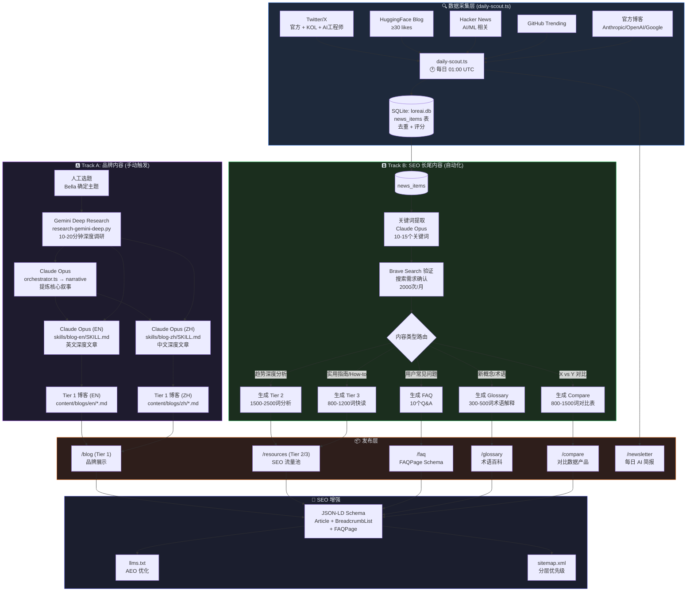
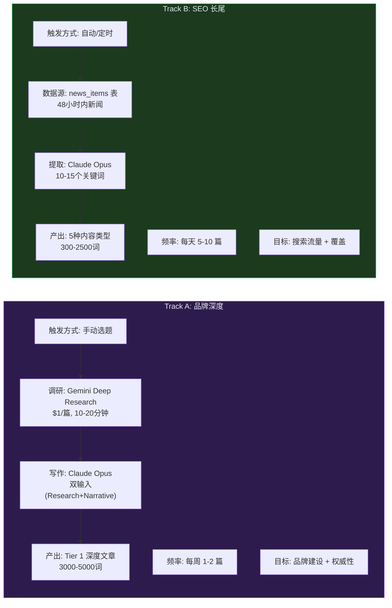
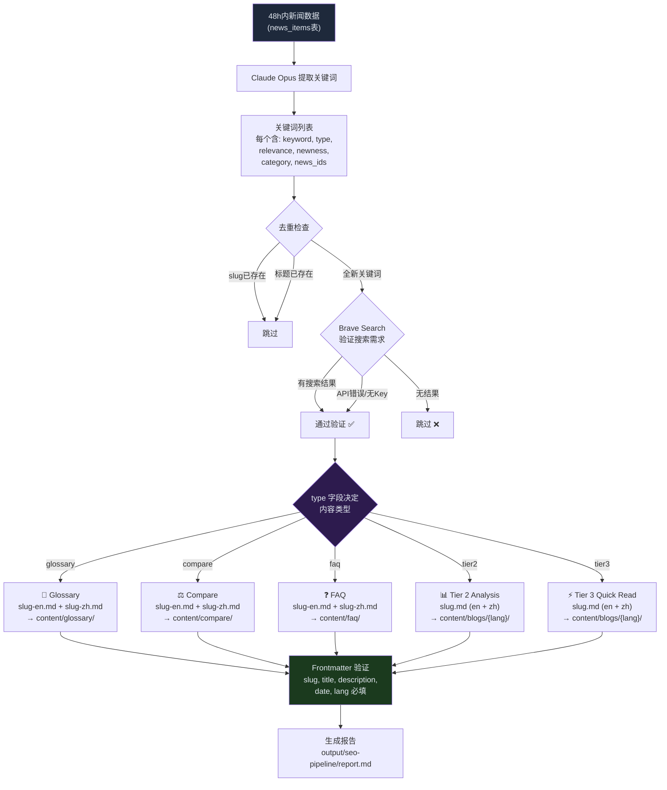
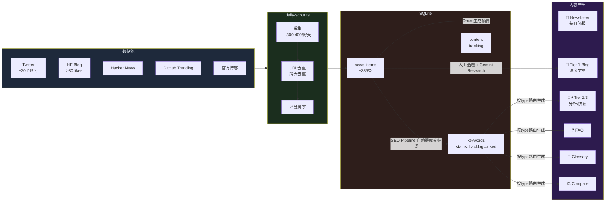
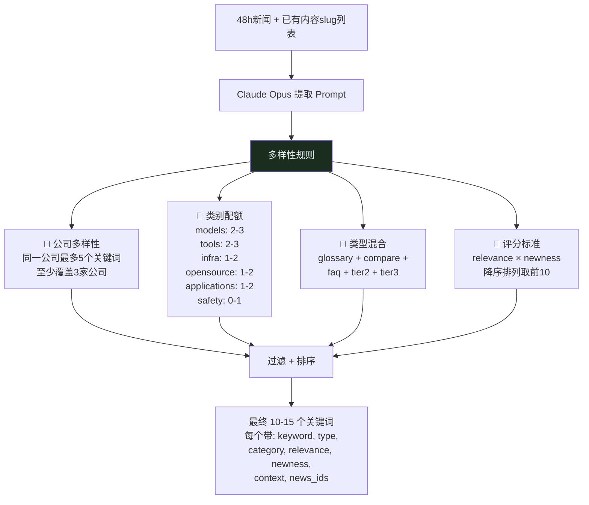

# LoreAI Pipeline Architecture

## Overview: Dual-Track Content Strategy

LoreAI 采用双轨内容策略，两条 Track 共享同一个数据源（daily-scout），但产出不同类型的内容。

## 整体架构图

## Track A vs Track B 详细对比

## 关键词到内容的路由逻辑

## 数据流：从新闻到页面

## 关键词提取的多样性控制

## 脚本与文件对应关系

| 脚本 | 功能 | 输入 | 输出 | 触发方式 |
|------|------|------|------|----------|
| `daily-scout.ts` | 新闻采集 | Twitter/HF/HN/GH/Blog APIs | `loreai.db:news_items` + Newsletter MD | Cron 01:00 UTC |
| `seo-pipeline.ts` | SEO 内容批量生成 | `loreai.db:news_items` | Glossary/FAQ/Compare/Blog MD | 待设 Cron 02:00 UTC |
| `orchestrator.ts` | Tier 1 深度文章 | 人工主题 | Research + Narrative + EN/ZH Blog | 手动 |
| `extract-keywords.ts` | 关键词提取(独立) | `output/research-report.md` | `loreai.db:keywords` | 被 orchestrator 调用 |
| `generate-tier2.ts` | Tier 2 生成(独立) | `loreai.db:keywords` | `content/blogs/{lang}/*.md` | 手动 |
| `extract-faq.ts` | FAQ 提取 | Blog MD | FAQ MD | 手动 |
| `extract-glossary.ts` | Glossary 提取 | Blog MD | Glossary MD | 手动 |
| `extract-compare.ts` | Compare 提取 | Blog MD | Compare MD | 手动 |
| `publish-faq.ts` | FAQ 发布到 content/ | `output/` FAQ files | `content/faq/` | 手动 |
| `research-gemini-deep.py` | Gemini 深度调研 | 主题关键词 | `output/research-gemini-deep.md` | 被 orchestrator 调用 |
| `validate-narrative.ts` | 叙事验证 | `output/core-narrative.json` | Pass/Fail | 被 orchestrator 调用 |
| `validate-blog.ts` | Blog Frontmatter 验证 | Blog MD files | Pass/Fail + 错误列表 | 手动 / CI |

## 成本结构

| 组件 | 成本 | 频率 |
|------|------|------|
| daily-scout (Gemini Flash) | ~$0.01/天 | 每天 |
| Newsletter (Claude Opus via Max) | 免费 | 每天 |
| SEO Pipeline (Claude Opus via Max) | 免费 | 每天 |
| Track A Research (Gemini Deep) | ~$1/篇 | 每周1-2次 |
| Track A Writers (Claude Opus via Max) | 免费 | 每周1-2次 |
| Brave Search API | 免费(2000次/月) | SEO验证 |

> 所有 Claude 调用都通过 `claude -p` CLI (Max Plan)，不消耗 API credits。
> Gemini 调用通过 API，按用量计费。
