# Claude Code Agent Teams: Multi-Agent Development with Opus 4.6

**TL;DR:** Anthropic releases Claude Opus 4.6 with Agent Teams, enabling 16 parallel AI agents to autonomously build a 100,000-line C compiler for $20,000.

## The Problem with Single-Agent Coding

As AI coding assistants evolved from autocomplete to autonomous agents, a fundamental limitation emerged: single-session context degradation. Long conversations caused "context rot" where models lost track of earlier decisions. Meanwhile, complex engineering tasks require parallel exploration—something a linear assistant couldn't provide.

The industry needed a paradigm shift from AI as copilot to AI as coordinated team.

## Agent Teams: A New Architecture for AI Development

On February 5, 2026, Anthropic released Claude Opus 4.6 with Agent Teams—a swarm-based architecture where multiple Claude instances operate as independent teammates. Unlike subagents that report linearly to a parent, Agent Teams features peer-to-peer communication, shared task lists with file locking, and a mailbox system for async messaging.

The key innovation: each teammate maintains its own context window, eliminating context rot. The lead agent orchestrates but doesn't bottleneck.

This isn't incremental improvement. It's a fundamental rethinking of how AI assists with software development.

## How Agent Teams Works

Agent Teams operates through four core components:

```mermaid
graph TD
    User["👤 User"] --> Lead["🎯 Team Lead<br/>(Primary Session)"]
    Lead --> TaskList["📋 Shared Task List<br/>~/.claude/tasks/"]
    Lead --> T1["🤖 Teammate 1<br/>(Independent Context)"]
    Lead --> T2["🤖 Teammate 2<br/>(Independent Context)"]
    Lead --> T3["🤖 Teammate 3<br/>(Independent Context)"]
    T1 <--> Mailbox["📬 Mailbox<br/>(P2P Messaging)"]
    T2 <--> Mailbox
    T3 <--> Mailbox
    T1 --> TaskList
    T2 --> TaskList
    T3 --> TaskList
    TaskList --> Git["🔀 Git Repo<br/>(File Locking)"]
```



**1. The Team Lead**
The primary Claude Code session initiated by the user. The Lead handles high-level planning, task decomposition, spawning teammates, and synthesizing final results.

**2. Teammates**
Independent Claude Code instances spawned by the Lead. Each operates in its own process with a unique context window. They don't inherit the Lead's conversation history but load project context files like `CLAUDE.md` and MCP servers.

**3. Shared Task List**
A file-based synchronization mechanism stored at `~/.claude/tasks/`. It tracks work items through states (pending, in progress, completed) and manages dependencies. When a blocking task finishes, dependent tasks automatically unblock.

**4. The Mailbox**
An inter-agent messaging system enabling asynchronous communication. Teammates use `message` (to specific agents) or `broadcast` (to the whole team) commands.

Users control display via the `--teammate-mode` flag—either in-process (toggle views with Shift+Up/Down) or split-pane with tmux/iTerm2 for simultaneous monitoring.

## The Carlini Experiment: Building a Compiler with AI

The defining demonstration of Agent Teams' capabilities came from Anthropic researcher Nicholas Carlini. To stress-test the system, Carlini tasked a team of 16 Claude Opus 4.6 agents to build a C compiler from scratch without human intervention.

The results:

- **16 agents** working in parallel
- **~2,000 Claude Code sessions** over two weeks
- **$20,000** in API costs
- **100,000 lines** of Rust code produced
- Successfully compiles **Linux 6.9** on x86, ARM, and RISC-V
- **99% pass rate** on GCC torture tests
- Can compile and run **Doom**

Each Claude instance operated in its own Docker container, cloning a shared Git repo, claiming tasks by writing lock files, and pushing completed code upstream. No human orchestration required.

## Why This Matters

The Carlini Experiment isn't just a technical demo—it's a preview of software development's future.

**Cost efficiency at scale**: $20,000 for a working compiler is a fraction of what a human team would cost for equivalent work over two weeks.

**Parallel exploration**: Multiple agents can investigate different approaches simultaneously. One debugs database latency while another checks frontend state management.

**Specialized lenses**: Different agents can review the same pull request with different focuses—security, performance, architectural consistency—all at once.

**Cross-layer refactoring**: Frontend, backend, and testing suites can be updated simultaneously by different agents, ensuring feature parity during migrations.

The release coincided within 27 minutes of OpenAI's GPT-5.3-Codex launch, signaling an intensification of the multi-agent AI coding race.

## Risks and Limitations

Agent Teams is currently a research preview, and the limitations are significant.

**Cost**: The $20,000 compiler experiment makes clear this isn't for routine development. Agent Teams suits high-value, complex projects—not everyday coding.

**File conflicts**: When multiple agents edit the same files, conflicts emerge. The coordination layer handles task claiming but not granular merge resolution within files. Precise task decomposition is critical.

**Experimental status**: The research preview designation signals instability. Enable it with:

```bash
export CLAUDE_CODE_EXPERIMENTAL_AGENT_TEAMS=1
```

Or add to `~/.claude/settings.json`:

```json
{
  "env": {
    "CLAUDE_CODE_EXPERIMENTAL_AGENT_TEAMS": "1"
  }
}
```

**Vibe Coding concerns**: The community has raised questions about over-reliance on AI orchestration without human oversight. Agent Teams is powerful, but it's not a replacement for engineering judgment.

## Frequently Asked Questions

### How is Agent Teams different from Claude Code subagents?

Subagents run within the main session's lifecycle and report only to the caller—they're sequential. Agent Teams creates independent processes with their own context windows that communicate peer-to-peer. Subagents suit quick tool usage; Agent Teams suits parallel exploration of massive codebases.

### How much does it cost to run Agent Teams?

Opus 4.6 pricing is $5 per million input tokens and $25 per million output tokens (same as Opus 4.5). The C compiler experiment cost approximately $20,000 over two weeks with 16 agents. For typical use cases with 2-4 agents on smaller tasks, expect costs in the $50-500 range depending on complexity and duration.

### Can I use Agent Teams today?

Yes, but it's a research preview. Enable it by setting `CLAUDE_CODE_EXPERIMENTAL_AGENT_TEAMS=1` in your environment or `~/.claude/settings.json`. Expect rough edges—the feature is explicitly experimental.

### How does Agent Teams compare to OpenAI Codex?

Claude Agent Teams focuses on deep reasoning and multi-day complex tasks with swarm-based architecture. OpenAI GPT-5.3-Codex emphasizes execution speed and OS integration as a "workhorse." Benchmarks show Claude leads in reasoning and verified code-fix tasks; Codex leads in execution speed and environment interaction.

## References

- [Anthropic releases Opus 4.6 with new 'agent teams'](https://techcrunch.com/2026/02/05/anthropic-releases-opus-4-6-with-new-agent-teams/) — TechCrunch, February 5, 2026
- [Sixteen Claude AI agents working together created a new C compiler](https://arstechnica.com/ai/2026/02/sixteen-claude-ai-agents-working-together-created-a-new-c-compiler/) — Ars Technica, February 6, 2026
- [Building a C compiler with a team of parallel Claudes](https://www.anthropic.com/engineering/building-c-compiler) — Anthropic Engineering Blog, February 5, 2026
- [Agent Teams Documentation](https://code.claude.com/docs/en/agent-teams) — Claude Code Docs, February 5, 2026
- [Breaking: Opus 4.6 and Agent Teams](https://hyperdev.matsuoka.com/p/article-opus-46-and-agent-teams) — HyperDev, February 5, 2026
