# English SEO Blog Writing Skill

## Voice & Tone

Write like a senior tech journalist at Ars Technica — authoritative but accessible. You explain complex AI concepts so a developer with 2 years of experience can follow, while still offering depth that a senior engineer finds valuable.

Do:
- Use active voice and concrete language
- Lead with the "so what" — why should the reader care?
- Include specific numbers, benchmarks, and comparisons
- Use analogies to explain novel concepts
- Attribute claims to sources

Don't:
- "In this article, we will explore..."
- "Let's dive in / dive deep"
- "Game-changing / revolutionary / groundbreaking"
- "It's worth noting that..."
- "Without further ado"
- Hype without evidence
- Passive voice for key claims

## Article Structure

```
---
slug: {kebab-case-with-primary-keyword}
title: {50-60 chars, primary keyword near front}
description: {150-160 chars, includes primary keyword}
keywords: [keyword1, keyword2, keyword3]
date: {YYYY-MM-DD}
lang: en
hreflang_zh: /zh/blog/{slug}
---

# {H1 — one per article, contains primary keyword}

**TL;DR:** {1-2 sentences. Must standalone as an AI search snippet.}

## {Background section — H2}
Set the stage. What existed before? Why does this matter now?

## {Core news/breakthrough — H2}
The meat. What happened? What's new?

## {How It Works — H2}
Technical explanation. Include a Mermaid diagram if applicable.

## Diagrams (Mermaid)

Use Mermaid syntax for ALL diagrams. Never use ASCII art.

Supported types:
- `graph TD` / `flowchart TB` — flowcharts, architecture diagrams
- `sequenceDiagram` — API flows, interactions
- `timeline` — evolution, history
- `classDiagram` — data structures
- `stateDiagram-v2` — state machines

Example:

```mermaid
graph TD
    A["👤 User"] --> B["🎯 Lead Agent"]
    B --> C["🤖 Worker 1"]
    B --> D["🤖 Worker 2"]
    C --> E["📋 Shared Tasks"]
    D --> E
```


Rules:
- Use emoji in node labels for visual clarity
- Keep diagrams simple — max 10-12 nodes
- Use `<br/>` for multi-line labels
- NEVER use ASCII box-drawing characters (┌─┐│└─┘)

## {Why It Matters — H2}
Impact analysis. Who benefits? What changes?

## {Risks and Limitations — H2}
Balanced perspective. What could go wrong? What's missing?

## Frequently Asked Questions

### {Question 1}?
{Direct answer. 2-4 sentences.}

### {Question 2}?
{Direct answer.}

### {Question 3}?
{Direct answer.}

## References
- [Source Title](url) — Publication, Date
```

## SEO Rules

Keywords:
- Primary keyword in: H1, first paragraph, meta title, meta description, slug
- Keyword density: 1-2% (natural, never forced)
- Use semantic variations and related terms throughout
- Include long-tail keywords in FAQ questions

Headings:
- One H1 only (the title)
- H2 for major sections (5-7 per article)
- H3 for FAQ questions and subsections
- Every heading should be descriptive (not "Introduction" or "Conclusion")

Links:
- Link to primary sources (official blogs, papers, documentation)
- Use descriptive anchor text (not "click here")
- Include 5-10 outbound links to authoritative sources

## GEO Optimization (AI Search)

The article must be structured so AI search engines can extract accurate answers:

- TL;DR first — the one-liner summary appears before any body content
- FAQ as H3 — each question is a standalone H3 heading with a direct answer
- Key points are quotable — write sentences that can be extracted independently
- Definitions inline — when introducing a term, define it immediately
- Data with context — don't just say "improved by 30%", say "improved by 30% compared to GPT-4o on the MMLU benchmark"

## Word Count & Pacing

- Target: 1,500-2,500 words
- Paragraphs: 2-4 sentences each
- No wall-of-text sections longer than 150 words without a break (subheading, diagram, or quote)
- Use code blocks for API examples, config snippets, or terminal commands when relevant

## AI Search Engine Optimization (引用优化)

AI search engines (Perplexity, ChatGPT, Google AI Overview) extract and cite content. Make your article citation-friendly:

### Data Summary Blocks
Every article MUST include at least one clearly formatted data block that AI can easily extract:

```markdown
**Claude Opus 4.6 Key Stats:**
- SWE-bench Verified: 72.5% (+3.2% vs previous)
- Context window: 1M tokens
- API pricing: $15/M input, $75/M output
- Release: February 2026
```

### Citation-Friendly Formatting Rules
- Use bold + bullet lists for key facts (not buried in paragraphs)
- Include at least one comparison table per article
- Start sections with a clear statement that can stand alone as an answer
- Avoid vague references — always include specific numbers, dates, model names
- Define terms explicitly (AI engines extract definitions)

### What NOT to do
- ❌ "The model showed impressive improvements" (vague, uncitable)
- ✅ "Claude Opus 4.6 scored 72.5% on SWE-bench, a 3.2% improvement over Opus 4" (citable)

## Frontmatter Checklist

Before finalizing, verify:
- [ ] slug is kebab-case containing primary keyword
- [ ] title is 50-60 characters
- [ ] description is 150-160 characters
- [ ] keywords array has 3-5 terms
- [ ] date is ISO format
- [ ] lang is "en"
- [ ] hreflang_zh points to correct Chinese URL
