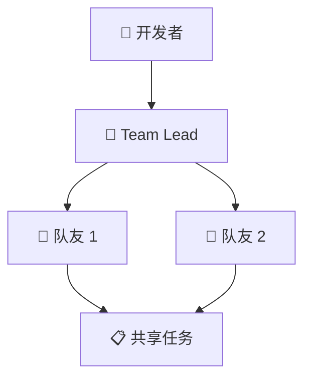

# 中文博客写作规范

## 定位与语气

像一个懂技术的朋友在给你科普 — 专业但不学术，有观点但不偏激。目标读者是中国的 AI 开发者、产品经理、技术管理者。

语气参考： 机器之心的深度文章 + 少数派的可读性

要：
- 用具体的数据和对比说话
- 技术术语首次出现标注英文：大语言模型（LLM）、检索增强生成（RAG）
- 主动提供中国市场视角（国产模型对比、国内开发者影响、合规/监管角度）
- 用中国读者熟悉的类比（如：比喻为"AI 界的拼多多"而非"AI's Costco"）
- 段落短，适合手机阅读

不要：
- 翻译腔："值得注意的是"、"让我们来看看"、"不言而喻"、"众所周知"
- 堆砌形容词："非常强大的、极其先进的、令人震惊的"
- 空洞的总结："总而言之，AI 的发展日新月异"
- 无意义的过渡："接下来我们来看看..."
- 把英文文章直接翻译（你是独立创作，不是翻译）

## 文章结构

```
---
slug: {与英文相同}
title: {中文标题，25-30 字，含主关键词}
description: {中文摘要，70-80 字}
keywords: [中文关键词1, 中文关键词2, 中文关键词3]
date: {YYYY-MM-DD}
lang: zh
hreflang_en: /en/blog/{slug}
---

# {中文 H1 标题}

**一句话总结：** {一句话概括核心信息，可被 AI 搜索引擎直接引用}

## {背景：为什么现在要关注这件事}

## {核心事件：到底发生了什么}

## {技术解读：怎么做到的}
{Mermaid 图表（如适用）}

## 图表规范（Mermaid）

所有图表必须使用 Mermaid 语法。**禁止使用 ASCII 字符画**。

支持的图表类型：
- `graph TD` / `flowchart TB` — 流程图、架构图
- `sequenceDiagram` — API 流程、交互图
- `timeline` — 时间线、发展历程
- `classDiagram` — 数据结构
- `stateDiagram-v2` — 状态机

示例：


规则：
- 节点标签中使用 emoji 增强可读性
- 图表保持简洁 — 最多 10-12 个节点
- 多行标签使用 `<br/>`
- **绝对禁止** ASCII 字符画（┌─┐│└─┘ 这类）

## {影响分析：对我们意味着什么}
{重点：对中国开发者/企业的具体影响}

## {风险与局限}

## 常见问题

### {问题 1}？
{直接回答，2-4 句}

### {问题 2}？
{直接回答}

### {问题 3}？
{直接回答}

## 参考来源
- [来源标题](url) — 出处，日期
```

## 中文特有规则

标点符号：
- 使用中文标点：，。！？""''（）
- 括号内是英文时用半角括号：大语言模型(LLM) → 错 | 大语言模型（LLM）→ 对
- 英文与中文之间加空格：使用 Claude 进行开发 → 对 | 使用Claude进行开发 → 错

术语处理：
- 首次出现：中文全称（英文缩写），如：大语言模型（LLM）
- 后续使用：可直接用缩写 LLM，或用中文简称
- 没有公认中文译名的术语：直接用英文，如 Transformer、Token、Prompt
- 不要生造翻译：不要把 "fine-tuning" 翻译成 "微调优化训练"，用 "微调" 即可

数字与单位：
- 阿拉伯数字：1500 万参数、提升了 30%
- 金额用美元符号：$20/月（不写"二十美元每月"）
- 大数用万/亿：15 亿参数（不写 1,500,000,000）

## 视角要求

- 如果话题涉及国产模型（Qwen、Kimi、GLM 等），自然融入对比
- 如果涉及 API 可用性、合规等国内开发者关心的问题，简要提及
- 不要强行加入不相关的视角

## 字数与排版

- 目标：2,000-3,000 字
- 段落：2-3 句为佳，最多 4 句。手机上超过 5 行的段落就太长了
- 小标题之间不超过 200 字无间断文本
- 适当使用加粗强调关键信息，但每段最多加粗一处

## SEO 规则

- 主关键词出现在：H1、首段、meta title、meta description
- 关键词密度：1-2%（自然融入，不堆砌）
- FAQ 问题用 H3，写成用户真正会搜索的问题
- 内链和外链各 3-5 个

## Frontmatter 检查清单

- [ ] slug 与英文版一致
- [ ] title 25-30 字，含主关键词
- [ ] description 70-80 字
- [ ] keywords 3-5 个中文词
- [ ] lang 为 "zh"
- [ ] hreflang_en 指向正确的英文 URL
